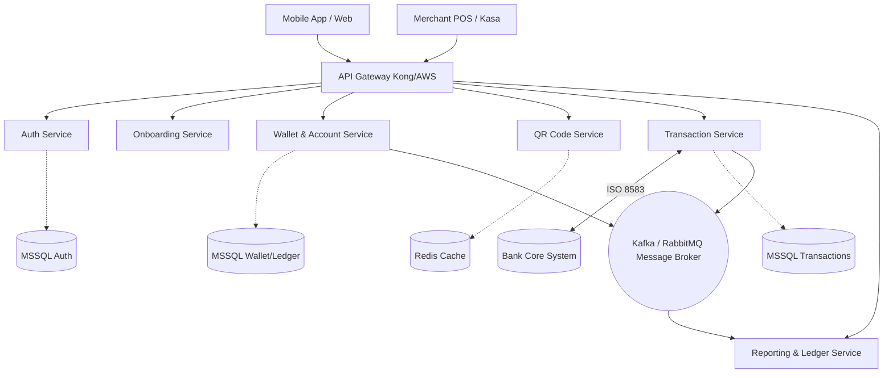
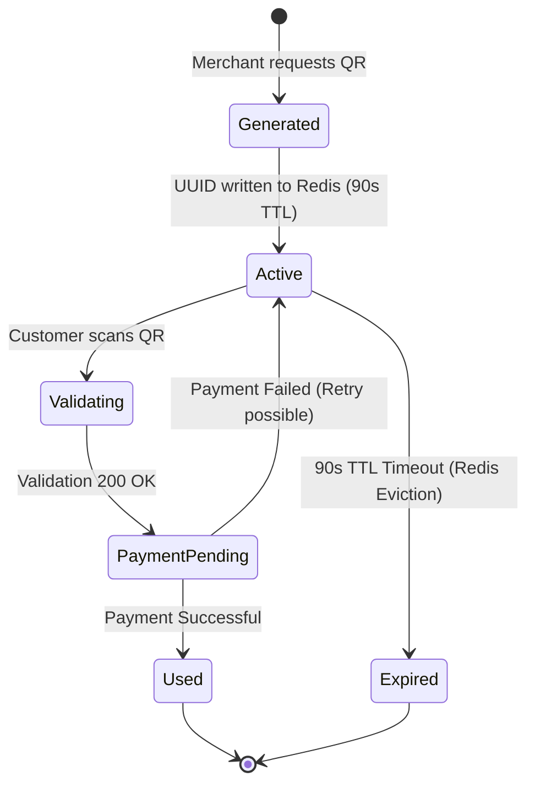
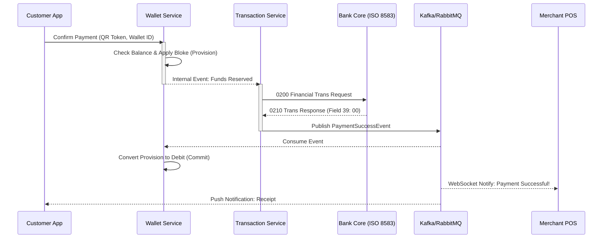

# QR Kod ile Ödeme Sistemi: Genel Sistem Mimarisi ve Bileşenler

## 1. Purpose & Scope (Amaç ve Kapsam)

Bu rapor, QR kod tabanlı anlık ödeme platformunun uçtan uca sistem tasarımını, servis mimarisini, veri akışlarını ve uygulama yol haritasını kapsamaktadır. Tasarım; Mikroservis Mimarisi ve Event-Driven (Olay Güdümlü) yaklaşımı esas alınarak kurgulanmış olup ISO 8583 finansal mesajlaşma standartlarıyla tam uyumludur. Auth, Onboarding, Wallet, QR Code, Transaction ve Reporting servisleri bu tasarımın dışına çıkılmadan hayata geçirilecektir.

## 2. Architecture & Bounded Context (Mimari ve Sınırlar)

Her mikroservis tek bir sorumluluk alanını yönetir ve diğer servislerden bağımsız olarak ölçeklenebilir.

- **Auth Service:** Müşteri, İşyeri ve Terminal kimlik doğrulaması (JWT / mTLS).
- **Onboarding Service:** Müşteri kaydı, KYC doğrulaması, İşyeri tanımlama.
- **Wallet & Account Service:** Cüzdan yönetimi, bakiye yükleme (Top-up), çift taraflı kayıt.
- **QR Code Service:** Dinamik QR üretimi, Redis TTL yönetimi, validasyon.
- **Transaction Service:** Ödeme akışı, ISO 8583 mesajlaşması, bloke/provision yönetimi.
- **Reporting & Ledger Service:** Mutabakat, raporlama, dijital makbuz üretimi.

## 3. Data Flow & Actors (Veri Akışı ve Aktörler)

Sistemin merkezinde aşağıdaki üç ana aktör yer almaktadır:

- **Müşteri (Customer):** Cüzdan oluşturur, bakiye yükler, QR okutarak ödeme yapar.
- **Üye İşyeri (Merchant):** Kasada QR üretir, ödeme bildirimini gerçek zamanlı alır.
- **Banka / Merkez Sistem:** ISO 8583 mesajlarını işler, yetkilendirme ve mutabakat sağlar.

## 4. Dependencies & Integrations (Bağımlılıklar ve Teknoloji Yığını)

Sistemin yüksek performanslı, tutarlı ve kurumsal mimari standartlarına uygun çalışabilmesi için belirlenen güncel teknoloji yığını aşağıdadır:

| Katman | Teknoloji / Araç | Gerekçe |
|---|---|---|
| **Backend Framework** | .NET 10 (C#) | Yüksek performans, olgun mikroservis ekosistemi ve güncel dil yetenekleri. |
| **Veritabanı (Finansal)** | MSSQL Server | İşlem bütünlüğünü (ACID uyumluluğu) garanti altına almak ve ilişkisel verileri güvenle saklamak. |
| **Önbellek & TTL** | Redis | Dinamik QR geçerlilik sürelerinin (90 saniye TTL) ve JWT oturumlarının yönetimi. |
| **Mesaj Kuyruğu** | Apache Kafka / RabbitMQ | Servisler arası asenkron olay iletişimini ve veri tutarlılığını sağlamak. |
| **Log ve Raporlama** | Elasticsearch | Sistemin ürettiği logları ve büyük hacimli işlem verilerini hızlı aramak/analiz etmek. |
| **Gerçek Zamanlı İletişim** | WebSocket / SSE | Kasa ekranlarına anında ödeme başarılı/başarısız bildirimleri iletmek. |

## 5. Wallet Management (Cüzdan ve Çift Taraflı Muhasebe)

Finansal tutarlılığı sağlamak için Double-Entry Bookkeeping prensibi uygulanmaktadır.

- Her para hareketi, eşit tutarda bir borç (Debit) ve alacak (Credit) kaydıyla gerçekleştirilir; para asla yoktan var olmaz.
- Müşteri kredi kartı veya Havale/EFT ile 100 TL yükleme başlatır.
- Aynı veritabanı transaction'ı (ACID) içinde iki kayıt yazılır: Debit: Banka Havuz Hesabı +100 TL, Credit: Müşteri Cüzdan Bakiyesi +100 TL.

| Kayıt Türü | Hesap | Tutar | Sonuç |
|---|---|---|---|
| Debit (Borç) | Banka Havuz Hesabı | +100,00 TL | Havuz şişer. |
| Credit (Alacak) | Müşteri Cüzdanı | +100,00 TL | Bakiye artar. |

## 6. QR Code Lifecycle (Dinamik QR Yaşam Döngüsü)

Güvenlik için Dinamik QR (Dynamic QR) kullanılmaktadır.

- Her işlem için benzersiz ve süreli bir QR üretilir; QR içeriğinde finansal veri tutulmaz, yalnızca veritabanındaki kayda işaret eden UUID tabanlı bir token yer alır.
- QR Service yeni bir UUID üretir ve Redis'e TTL ile birlikte yazar.
- 90 saniye dolduğunda Redis kaydı otomatik silinir; QR geçersiz hale gelir.
- Redis'te token bulunamazsa veya TTL dolduysa: `410 Gone — QR Expired` hatası döner.
- Token aktifse müşteri ekranında işyeri adı ve tutar gösterilir, onay beklenir.

## 7. Payment Flows (Ödeme Akışı ve Asenkron İletişim)

Ödeme süreci ISO 8583 protokolü ve Event-Driven mimari ile işlenir.

- Müşteri 'Öde' butonuna bastığı anda Wallet Service müşteri bakiyesini kontrol eder; yeterli bakiye varsa işlem tutarı kadar Bloke (Provision) koyar.
- Bakiye yetersizse akış burada sonlanır: Hata kodu `51 — Yetersiz Bakiye` döner.
- Transaction Service, işlemi ISO 8583 formatına dönüştürür ve Banka Core Sistemine iletir.
- Field 39 Response Code işleme alınır. Sonuç asenkron olarak Kafka/RabbitMQ üzerinden tüm servislere yayınlanır.

### 7.1 ISO 8583 Mesaj Yapısı

ISO 8583, bankacılık sistemlerinin birbiriyle konuştuğu bit-map tabanlı finansal mesajlaşma protokolüdür.

| Field No | Alan Adı | Örnek Değer | Açıklama |
|---|---|---|---|
| MTI | Message Type Identifier | 0200 | Financial Transaction Request. |
| Field 3 | Processing Code | 000000 | Mal/Hizmet Satın Alma. |
| Field 4 | Amount | 000000015000 | 150,00 TL (son 2 hane kuruş). |
| Field 11 | STAN | 123456 | İşlemi takip eden eşsiz numara. |
| Field 42 | Card Acceptor ID | MERCHANT_ID_999 | Üye işyeri kimliği. |
| Field 43 | Card Acceptor Name | Ahmet Market Istanbul TR | İşyeri adı ve konumu. |
| Field 61 | QR Data | 8f3b9a2c-d91e... | Dinamik QR Token taşınır. |

### 7.2 Banka Yanıt Kodları (Field 39)

| Response Code | Anlamı | Sistemin Aksiyonu |
|---|---|---|
| 00 | Başarılı | Bloke kesinleşir, işyerine kredi yazılır. |
| 51 | Yetersiz Bakiye | Bloke kaldırılır, hata mesajı iletilir. |
| 91 | Sistem Hatası | Reversal (0420) mesajı tetiklenir. |
| 05 | Genel Hata / Reddedildi | İşlem iptal edilir, loglanır. |

## 8. Transactions Tablosu Veri Modeli

| Sütun | Tip | Açıklama |
|---|---|---|
| id | UUID (PK) | Benzersiz işlem kimliği. |
| customer_wallet_id | UUID (FK) | Ödemeyi yapan müşteri cüzdanı. |
| merchant_id | VARCHAR | Üye işyeri kimliği. |
| terminal_id | VARCHAR | İşlemin gerçekleştiği kasa. |
| amount | DECIMAL(18,2) | İşlem tutarı. |
| status | VARCHAR | PENDING, SUCCESS, FAILED, REVERSED. |
| iso_resp_code | VARCHAR | Bankadan dönen Field 39 kodu (00, 51 vb.). |
| qr_token | UUID | İlişkili dinamik QR token. |
| created_at | TIMESTAMP | İşlem başlama zamanı. |

## 9. Failure Scenarios & Resiliency (Hata Senaryoları)

- Banka 51, 91 veya timeout döndürür.
- Transaction Service `0420 Reversal` mesajı tetikler.
- Müşteri cüzdanındaki bloke kaldırılır; bakiye tam olarak eski haline döner.
- Hata kodu ve açıklaması kasa ekranı ile müşteri uygulamasına iletilir.

## 10. Security & Compliance (Güvenlik)

- Kullanıcı kimlik doğrulaması OAuth 2.0 protokolü ve JWT (JSON Web Token) temeline dayanmaktadır.
- Doğrulama başarılıysa kısa ömürlü Access Token (15 dk) ve Refresh Token üretilir.
- Üye işyerinin kasası, API Key + Secret Key veya Mutual TLS (mTLS) mekanizmasıyla doğrulanır.
- Terminal, QR üretme isteği gönderirken HTTP Header'a `X-Terminal-Sign` ekler.
- `X-Terminal-Sign`, istek gövdesinin HMAC-SHA256 ile imzalanmış halidir.
- Auth Service imzayı doğrular; eşleşmezse istek reddedilir (`403 Forbidden`).

## 11. Deployment Phases (Uygulama Yol Haritası)

- **Faz 1:** Temel Altyapı (Auth Service, MSSQL Şemaları, API Gateway).
- **Faz 2:** QR ve Cüzdan (QR Code Service ve Redis, Double-Entry tabanlı Wallet Service).
- **Faz 3:** Ödeme Çekirdeği (Transaction Service .NET 10 adaptasyonu ve ISO 8583 entegrasyonu).
- **Faz 4:** Asenkron İletişim (Kafka entegrasyonları, WebSocket ile canlı kasa bildirimleri).
- **Faz 5:** Raporlama ve Canlı Ortam (Ledger Service, Yük Testleri ve Go-Live).
