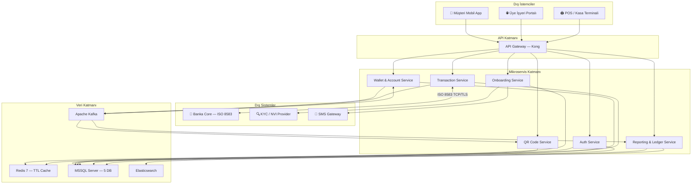
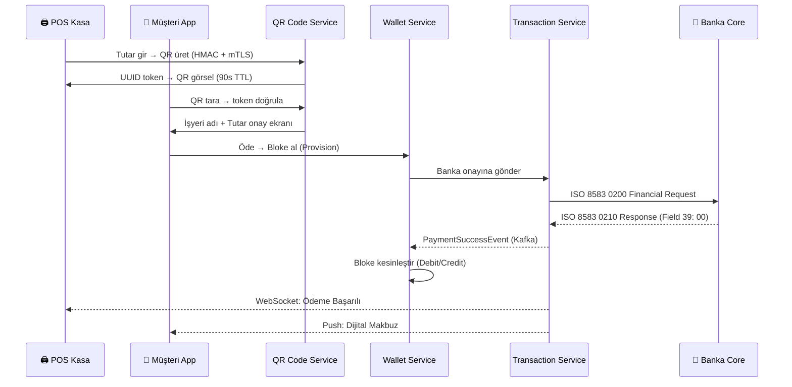
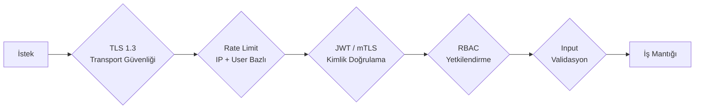

# System Overview — QR Kod ile Ödeme Sistemi

> **Related Modules:** Tüm modüller için bkz. [`../INDEX.md`](../INDEX.md)
> **Detaylı mimari özet:** [`../../SYSTEM-OVERVİEW.md`](../../SYSTEM-OVERVİEW.md)

---

## 1. Purpose & Scope (Amaç ve Kapsam)

Bu sistem; Banka, Üye İşyeri ve Müşteri aktörleri arasında **QR kod tabanlı anlık ödeme** altyapısı sunar. Tasarım; **Mikroservis Mimarisi**, **Event-Driven (Olay Güdümlü)** iletişim ve **ISO 8583** finansal mesajlaşma standardı üzerine kuruludur.

**Temel hedefler:**

| Hedef | Açıklama |
|---|---|
| **Güvenlik** | Finansal veri QR içinde taşınmaz; yalnızca kısa ömürlü UUID token kullanılır. |
| **Tutarlılık** | Double-Entry Bookkeeping ile her kuruşun izi sürülebilir. |
| **Dayanıklılık** | Timeout ve banka hatalarında `0420 Reversal` ile otomatik geri alma. |
| **Ölçeklenebilirlik** | Her servis bağımsız yatay ölçeklenebilir; Kafka ile gevşek bağlılık. |
| **Uyumluluk** | KVKK, MASAK (AML) ve PCI-DSS prensipleri gözetilmiştir. |

---

## 2. Architecture & Bounded Context (Mimari ve Servis Sınırları)

Sistem 7 mikroservis ve destekleyici altyapı bileşenlerinden oluşur. Her servis kendi veritabanına sahiptir; servisler arası doğrudan DB erişimi yoktur.

### 2.1 Mikroservis Listesi

| # | Servis | Sorumluluk | Doküman |
|---|---|---|---|
| 1 | **Auth Service** | JWT/OAuth 2.0, mTLS, Terminal HMAC doğrulama | [`../01-auth-service/`](../01-auth-service/README.md) |
| 2 | **Onboarding Service** | Müşteri KYC/AML kaydı, Üye İşyeri tanımlama | [`../02-onboarding-service/`](../02-onboarding-service/README.md) |
| 3 | **Wallet & Account Service** | Cüzdan, Double-Entry muhasebe, Bloke/Provision | [`../03-wallet-service/`](../03-wallet-service/README.md) |
| 4 | **QR Code Service** | Dinamik QR üretimi, Redis TTL, UUID yaşam döngüsü | [`../04-qr-code-service/`](../04-qr-code-service/README.md) |
| 5 | **Transaction Service** | ISO 8583 ödeme akışı, Banka iletişimi, Reversal | [`../05-transaction-service/`](../05-transaction-service/README.md) |
| 6 | **Switch Entegrasyon** | Banka/kart şeması TCP/TLS bağlantısı (Transaction Service içinde) | [`../05-transaction-service/`](../05-transaction-service/README.md) |
| 7 | **Reporting & Reconciliation** | Mutabakat, Elasticsearch, makbuz, günlük özet | [`../06-reporting-service/`](../06-reporting-service/README.md) |

> **Not:** Switch Entegrasyon Servisi, Transaction Service içinde **Bank Connector** alt bileşeni olarak implemente edilmiştir. Kart şemalarına (BKM, Visa, Mastercard) bağlantı tek noktadan yönetilir.

### 2.2 Sistem Mimarisi (Büyük Resim)

---

## 3. Data Flow & Actors (Veri Akışı ve Aktörler)

### 3.1 Ana Aktörler

| Aktör | Rol | Kimlik Doğrulama |
|---|---|---|
| **Müşteri** | Cüzdan oluşturur, bakiye yükler, QR ile ödeme yapar | Username + Şifre + TOTP 2FA → JWT |
| **Üye İşyeri (Merchant)** | Kasadan QR üretir, ödeme bildirimini alır | API Key + Secret → JWT |
| **POS Terminali** | Kasada QR gösterir, anlık bildirim bekler | mTLS + HMAC-SHA256 |
| **Banka / Switch** | ISO 8583 mesajlarını işler, yanıt verir | TLS 1.2+, sertifika pinning |

### 3.2 Uçtan Uca Ödeme Akışı (Özet)

---

## 4. Dependencies & Integrations (Teknoloji Yığını)

| Katman | Teknoloji | Gerekçe |
|---|---|---|
| **Backend Framework** | .NET 10 (C#) | Yüksek performans, olgun mikroservis ekosistemi, ISO 8583 parser desteği |
| **Finansal Veritabanı** | MSSQL Server 2022 | ACID uyumluluğu; Double-Entry finansal kayıtlar için güvenilir |
| **Cache & TTL** | Redis 7 | QR token'larının 90s ömrü, JWT blacklist, STAN atomic counter |
| **Message Broker** | Apache Kafka | Yüksek throughput event streaming; consumer group ile servis izolasyonu |
| **Arama & Raporlama** | Elasticsearch 8 | Full-text arama, aggregation, ILM ile 10 yıllık veri yönetimi |
| **Gerçek Zamanlı** | ASP.NET SignalR | Kasa ekranlarına anlık ödeme bildirimi (WebSocket) |
| **API Gateway** | Kong | JWT doğrulama, rate limiting, tek giriş noktası |
| **Container** | Docker + Kubernetes | Bağımsız ölçeklendirme, self-healing, sıfır-downtime deployment |
| **KYC** | MERNİS/NVI API + Onfido | TC Kimlik doğrulama ve yüz eşleştirme |
| **ISO 8583** | Custom .NET Parser / OpenIso8583.Net | Banka mesajlaşma protokolü (ADR-004 araştırılıyor) |

---

## 5. Failure Scenarios & Resiliency (Hata Senaryoları — Genel)

| Senaryo | Servis Etkisi | Sistem Tepkisi |
|---|---|---|
| **Banka timeout (30s)** | Transaction | `0420 Reversal` tetiklenir; Provision iptal; müşteri bakiyesi iade |
| **Redis down** | QR Code, Auth | Circuit Breaker; aktif QR'lar `EXPIRED` sayılır; blacklist bypass |
| **Kafka broker down** | Tüm servisler | Outbox Pattern; DB'ye yazılır; Worker retry yapar |
| **MSSQL primary down** | Wallet, Transaction | Always On AG; 30s içinde otomatik failover |
| **Elasticsearch down** | Reporting | MSSQL `daily_summaries` tablosu fallback |
| **Reversal başarısız (5 deneme)** | Transaction | `MANUAL_INTERVENTION` durumu; ops ekibine PagerDuty alert |

---

## 6. Security & Compliance (Güvenlik Özeti)

| Güvenlik Katmanı | Mekanizma |
|---|---|
| **Transport** | TLS 1.3 (tüm bağlantılar) |
| **Token** | RS256 asimetrik JWT; 15 dk Access Token; 7 gün Refresh Token |
| **Terminal** | mTLS (çift taraflı sertifika) + HMAC-SHA256 imza |
| **Şifre** | BCrypt cost=12; TCKN sadece SHA-256 hash olarak saklanır |
| **2FA** | TOTP (RFC 6238) — müşteri hesapları |
| **QR Güvenliği** | QR içinde finansal veri yok; yalnızca UUID referansı |
| **Uyumluluk** | KVKK (veri minimizasyonu, silme hakkı), MASAK/AML kontrolleri |

