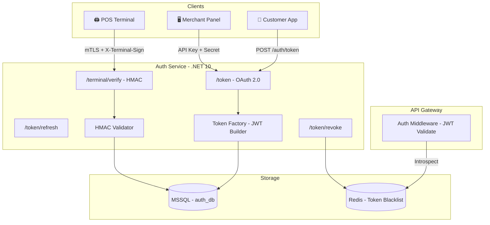
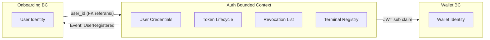
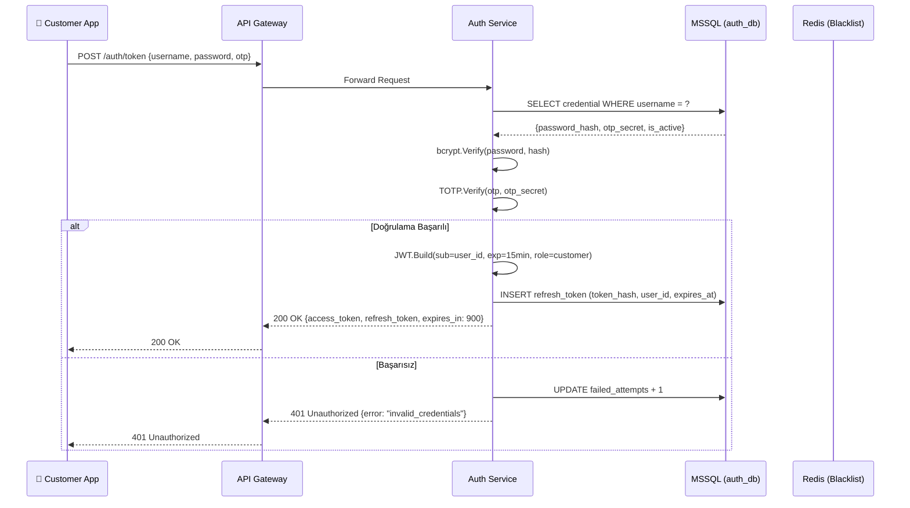
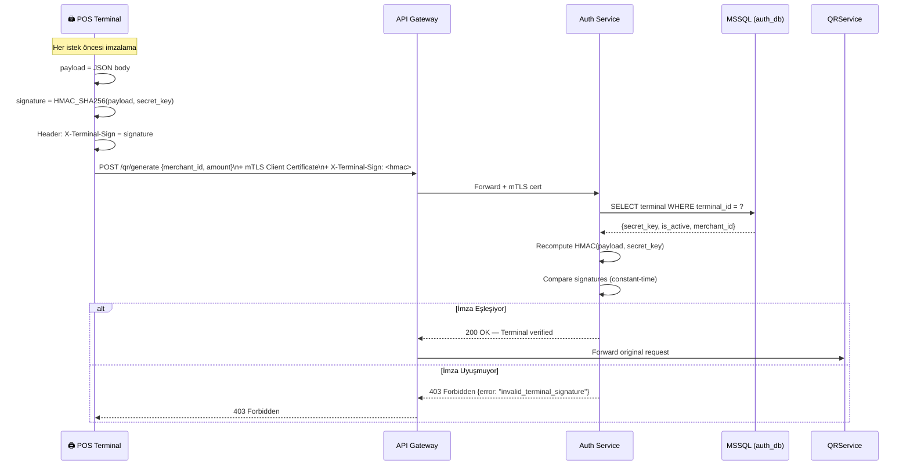
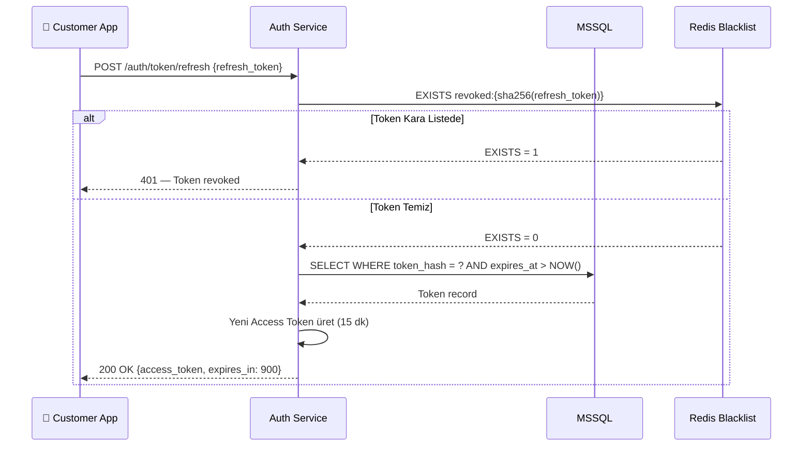
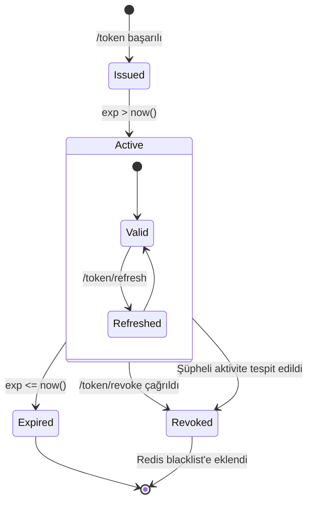

# Auth Service — Kimlik Doğrulama ve Yetkilendirme Servisi

> **Related Modules:**
> - [`../02-onboarding-service/`](../02-onboarding-service/README.md) — Kullanıcı/İşyeri kayıtları buradan beslenir.
> - [`../03-wallet-service/`](../03-wallet-service/README.md) — Wallet işlemleri Auth token doğrulaması gerektirir.
> - [`../05-transaction-service/`](../05-transaction-service/README.md) — Her ödeme isteği Auth middleware'inden geçer.
> - [`../08-security/`](../08-security/README.md) — HMAC, mTLS ve sertifika yönetimi detayları.

---

## 1. Purpose & Scope (Amaç ve Kapsam)

Auth Service, sistemdeki tüm aktörlerin (Müşteri, Üye İşyeri, POS Terminali) kimliklerini doğrulayan ve yetkilendiren merkezi güven noktasıdır. Bu servis olmadan hiçbir downstream servis çağrısı işleme alınmaz.

**Kapsam dahilindeki sorumluluklar:**

| Sorumluluk | Açıklama |
|---|---|
| **Customer Auth** | Mobil uygulama kullanıcısı; username/password + OTP ile giriş. |
| **Merchant Auth** | Üye işyeri paneli; API Key + Secret Key kombinasyonu. |
| **Terminal Auth** | POS kasası; mTLS (Mutual TLS) + HMAC-SHA256 imzalı istek. |
| **Token Yönetimi** | Access Token (15 dk) + Refresh Token (7 gün) üretimi ve iptali. |
| **Token Doğrulama** | Downstream servislerin gönderdiği JWT'leri doğrulama (introspection). |

**Kapsam dışı:**
- Kullanıcı profil yönetimi → `02-onboarding-service`
- İzin/yetki (RBAC) kuralları → `08-security`

---

## 2. Architecture & Bounded Context (Mimari ve Sınırlar)

Auth Service, **stateless** bir yapıda çalışır; token doğrulaması için harici bir state store'a ihtiyaç duymaz (JWT self-contained'dir). Ancak Refresh Token ve iptal edilmiş token listesi (token revocation) için MSSQL kullanılır.



### Bounded Context Sınırları



> **Trade-off:** Auth Service kendi `users` tablosunu tutmaz; yalnızca `credentials` ve `tokens` tablolarını yönetir. Bu, Onboarding Service ile net bir bounded context sınırı çizer ve bağımlılığı tek yönlü tutar.

---

## 3. Data Flow & Actors (Veri Akışı ve Aktörler)

### 3.1 Müşteri Kimlik Doğrulama Akışı



### 3.2 Terminal (POS Kasası) Kimlik Doğrulama Akışı



### 3.3 Token Yenileme (Refresh) Akışı



---

## 4. Dependencies & Integrations (Bağımlılıklar)

| Bileşen | Teknoloji | Kullanım Amacı |
|---|---|---|
| **Veritabanı** | MSSQL Server | `credentials`, `refresh_tokens`, `terminal_registry` tabloları. |
| **Cache / Blacklist** | Redis | İptal edilen token'ların blacklist'e alınması; API Gateway hızlı sorgu. |
| **Kütüphane** | `System.IdentityModel.Tokens.Jwt` (.NET) | JWT üretimi ve doğrulaması. |
| **OTP** | `Otp.NET` (TOTP/RFC 6238) | Müşteri 2FA doğrulaması. |
| **Password Hashing** | `BCrypt.Net-Next` | Şifre hash'leme (cost factor: 12). |
| **mTLS** | ASP.NET Core Certificate Auth | Terminal sertifika doğrulaması. |
| **Monitoring** | Elasticsearch | Başarısız giriş denemeleri, anomali tespiti. |

### MSSQL Şema — Auth DB

```sql
-- Kimlik bilgileri (Onboarding'den doldurulur)
CREATE TABLE credentials (
    user_id         UNIQUEIDENTIFIER PRIMARY KEY,
    username        NVARCHAR(100) NOT NULL UNIQUE,
    password_hash   NVARCHAR(256) NOT NULL,         -- BCrypt
    otp_secret      NVARCHAR(64),                   -- Base32 encoded TOTP secret
    role            VARCHAR(20) NOT NULL,            -- customer | merchant | admin
    is_active       BIT NOT NULL DEFAULT 1,
    failed_attempts TINYINT NOT NULL DEFAULT 0,
    locked_until    DATETIME2,
    created_at      DATETIME2 NOT NULL DEFAULT GETUTCDATE()
);

-- Aktif Refresh Token'lar
CREATE TABLE refresh_tokens (
    id              UNIQUEIDENTIFIER PRIMARY KEY DEFAULT NEWID(),
    user_id         UNIQUEIDENTIFIER NOT NULL REFERENCES credentials(user_id),
    token_hash      NVARCHAR(256) NOT NULL UNIQUE,  -- SHA-256(raw_token)
    expires_at      DATETIME2 NOT NULL,
    ip_address      NVARCHAR(45),
    user_agent      NVARCHAR(512),
    created_at      DATETIME2 NOT NULL DEFAULT GETUTCDATE(),
    revoked_at      DATETIME2
);

-- Terminal Kayıt Defteri
CREATE TABLE terminal_registry (
    terminal_id     NVARCHAR(64) PRIMARY KEY,
    merchant_id     NVARCHAR(64) NOT NULL,
    secret_key      NVARCHAR(256) NOT NULL,          -- HMAC secret
    certificate_cn  NVARCHAR(256),                   -- mTLS CN
    is_active       BIT NOT NULL DEFAULT 1,
    created_at      DATETIME2 NOT NULL DEFAULT GETUTCDATE()
);
```

---

## 5. Failure Scenarios & Resiliency (Hata Senaryoları)

### 5.1 Token Durumları



### 5.2 Hata Matrisi

| Senaryo | HTTP Kodu | Sistem Aksiyonu |
|---|---|---|
| Yanlış şifre (1-4. deneme) | `401` | `failed_attempts + 1`, log kaydı. |
| Yanlış şifre (5. deneme) | `429` | Hesap `locked_until = NOW() + 30min`. |
| Süresi dolmuş Access Token | `401` | Client `/token/refresh` çağırmalı. |
| Geçersiz / Revoked Refresh Token | `401` | Kullanıcı yeniden login yapmalı. |
| HMAC imza uyuşmazlığı | `403` | İstek reddedilir, güvenlik logu yazılır. |
| mTLS sertifika doğrulama hatası | `403` | TLS handshake kesilir. |
| MSSQL erişim hatası | `503` | Circuit Breaker açılır, Retry policy (Polly). |
| Redis erişim hatası | `⚠️ Degraded` | Blacklist sorgusu atlanır, log uyarısı. |

> **Not:** Redis'in geçici olarak erişilememesi durumunda sistem çökmez; blacklist kontrolü "pass-through" moduna geçer. Bu bir güvenlik trade-off'tur; kabul edilebilir risk süresi max. 60 saniyedir (Redis health check aralığı).

### 5.3 Polly Retry Konfigürasyonu (.NET 10)

```csharp
// Auth Service — MSSQL bağlantısı için Retry Policy
services.AddHttpClient<IAuthRepository, SqlAuthRepository>()
    .AddPolicyHandler(Policy
        .Handle<SqlException>()
        .WaitAndRetryAsync(
            retryCount: 3,
            sleepDurationProvider: attempt => TimeSpan.FromSeconds(Math.Pow(2, attempt)),
            onRetry: (ex, ts, attempt, ctx) =>
                logger.LogWarning("DB retry {Attempt} after {Delay}s", attempt, ts.TotalSeconds)
        )
    );
```

---

## 6. Security & Compliance (Güvenlik)

### JWT Yapısı

```json
// Header
{
  "alg": "RS256",
  "typ": "JWT",
  "kid": "auth-key-2026-v1"
}

// Payload
{
  "sub":   "a3f4b2c1-...",       // user_id (UUID)
  "role":  "customer",           // customer | merchant | terminal
  "iss":   "auth.xox-pay.com",
  "aud":   "xox-pay-api",
  "iat":   1748188800,
  "exp":   1748189700,           // iat + 900 saniye (15 dk)
  "jti":   "unique-token-id"     // Replay attack koruması
}
```

> **Neden RS256?** HS256 (simetrik) ile tüm servisler aynı secret'ı bilmek zorundadır; bu, bir servisin ele geçirilmesi halinde tüm sistemi tehlikeye atar. RS256 (asimetrik) ile downstream servisler yalnızca **public key** ile doğrulama yapar; **private key** sadece Auth Service'te bulunur.

### Güvenlik Katmanları

| Katman | Mekanizma | Amaç |
|---|---|---|
| **Transport** | TLS 1.3 (zorunlu) | Tüm trafiği şifreler. |
| **Terminal** | mTLS + HMAC-SHA256 | Çift taraflı kimlik doğrulama. |
| **Şifre** | BCrypt (cost=12) | Rainbow table ve brute-force koruması. |
| **Token** | RS256, kısa TTL | İmzalanmış, sahte üretilemeyen token. |
| **2FA** | TOTP (RFC 6238) | Müşteri hesaplarına ikinci faktör. |
| **Rate Limit** | API Gateway (Kong) | Brute-force saldırı engelleme. |
| **Audit Log** | Elasticsearch | Tüm auth eventleri kaydedilir, SIEM entegrasyonu. |


