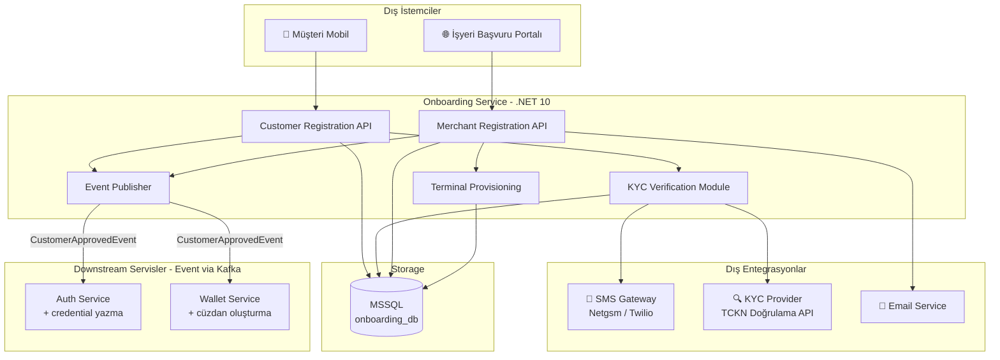
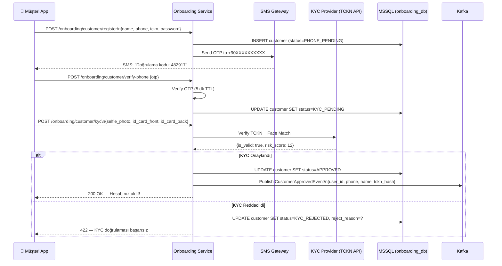
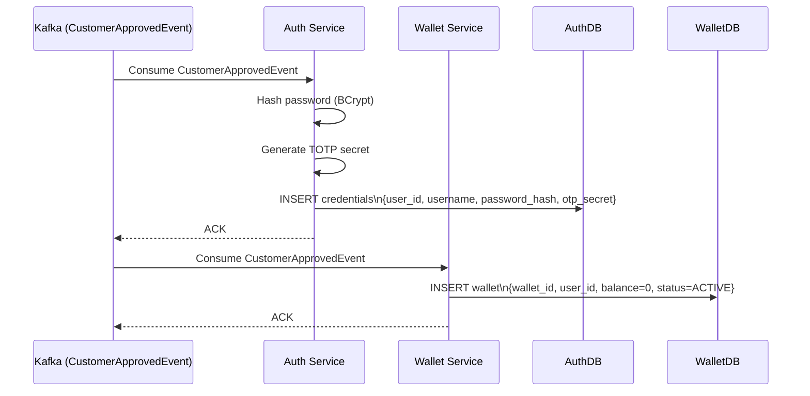
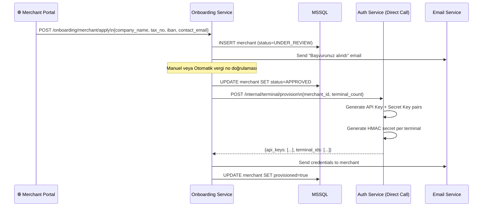
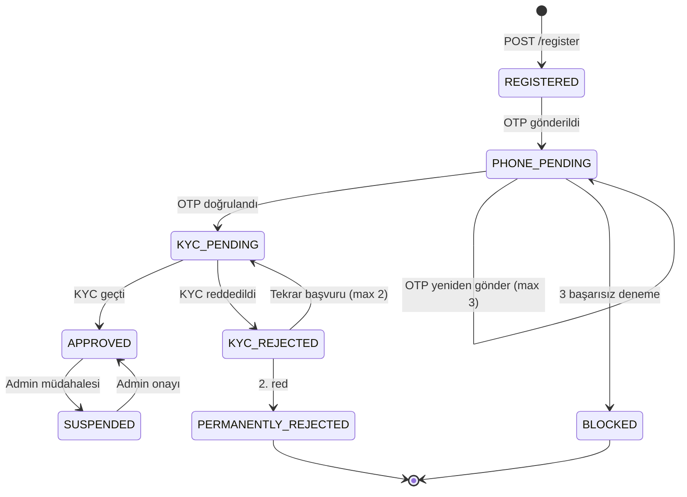
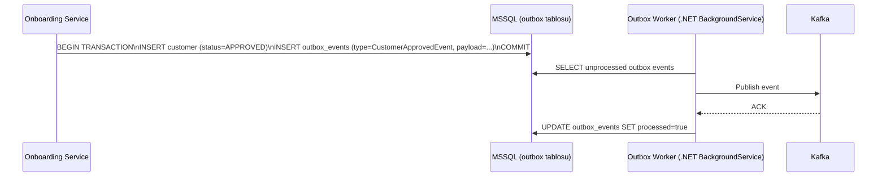

# Onboarding Service — Müşteri Kaydı, KYC ve İşyeri Tanımlama

> **Related Modules:**
> - [`../01-auth-service/`](../01-auth-service/README.md) — Başarılı kayıt sonrası Auth DB'ye credential yazılır.
> - [`../03-wallet-service/`](../03-wallet-service/README.md) — Onboarding tamamlanınca otomatik cüzdan oluşturulur.
> - [`../08-security/`](../08-security/README.md) — KYC veri güvenliği ve KVKK uyumu.
> - [`../11-adr/`](../11-adr/README.md) — ADR-002: KYC Provider seçimi.

---

## 1. Purpose & Scope (Amaç ve Kapsam)

Onboarding Service, sisteme katılan her aktörün (Müşteri ve Üye İşyeri) yaşam döngüsünü başlatan servistir. Bu servis olmadan ne Auth Service'e credential yazılır ne de Wallet Service'e cüzdan oluşturma komutu gönderilir.

**Kapsam dahilindeki sorumluluklar:**

| Aktör | Süreç | Çıktı |
|---|---|---|
| **Müşteri (Customer)** | Kayıt formu → Telefon OTP doğrulama → KYC belgesi yükleme → Onay | Credential + Boş Cüzdan |
| **Üye İşyeri (Merchant)** | Başvuru formu → Belge doğrulama → Sözleşme → API Key üretimi | Merchant profili + Terminal kaydı |

**Kapsam dışı:**
- Login / Token üretimi → `01-auth-service`
- Cüzdan bakiyesi ve para hareketi → `03-wallet-service`
- Ödeme işlemleri → `05-transaction-service`

---

## 2. Architecture & Bounded Context (Mimari ve Sınırlar)



### Bounded Context Sınırları

Onboarding Service, kullanıcının **kimliğini** kurar ancak kimlik doğrulamasını **yapmaz**. Onay sonrası downstream servislere event yayınlar — doğrudan HTTP çağrısı yapmaz. Bu sayede Onboarding Service'in yeniden başlatılması veya güncellenmesi diğer servisleri etkilemez.

> **Trade-off:** Event-driven onboarding gecikme (eventual consistency) getirir. Kullanıcı "Kayıt Başarılı" mesajını görmesine rağmen cüzdanı milisaniyeler sonra oluşabilir. Çözüm: UI tarafında polling veya WebSocket ile "Cüzdanınız hazırlanıyor..." durumu gösterilmesi.

---

## 3. Data Flow & Actors (Veri Akışı ve Aktörler)

### 3.1 Müşteri Kayıt Akışı



### 3.2 Müşteri Onay Sonrası Downstream Akışı (Event-Driven)



### 3.3 Üye İşyeri Kayıt Akışı



### 3.4 Onboarding Durum Makinesi



---

## 4. Dependencies & Integrations (Bağımlılıklar)

| Bileşen | Teknoloji | Kullanım Amacı |
|---|---|---|
| **Veritabanı** | MSSQL Server | Müşteri ve merchant profilleri, KYC durumu. |
| **SMS Gateway** | Netgsm / Twilio | Telefon doğrulama OTP gönderimi. |
| **KYC Provider** | MERNİS TCKN API / Onfido | TC Kimlik ve yüz eşleştirme doğrulaması. |
| **Dosya Depolama** | Azure Blob / MinIO | KYC belgeleri (kimlik fotoğrafı, selfie). |
| **Message Broker** | Apache Kafka | `CustomerApprovedEvent`, `MerchantApprovedEvent` yayını. |
| **Email** | SendGrid / SMTP | İşyeri credential ve bildirim mailleri. |

### MSSQL Şema — Onboarding DB

```sql
CREATE TABLE customers (
    id              UNIQUEIDENTIFIER PRIMARY KEY DEFAULT NEWID(),
    full_name       NVARCHAR(200) NOT NULL,
    phone           NVARCHAR(20) NOT NULL UNIQUE,
    tckn_hash       NVARCHAR(256) NOT NULL,       -- SHA-256(TCKN), ham TCKN saklanmaz
    status          VARCHAR(30) NOT NULL,          -- REGISTERED | PHONE_PENDING | KYC_PENDING | APPROVED | ...
    kyc_risk_score  SMALLINT,
    reject_reason   NVARCHAR(500),
    created_at      DATETIME2 NOT NULL DEFAULT GETUTCDATE(),
    updated_at      DATETIME2 NOT NULL DEFAULT GETUTCDATE()
);

CREATE TABLE merchants (
    id              UNIQUEIDENTIFIER PRIMARY KEY DEFAULT NEWID(),
    company_name    NVARCHAR(200) NOT NULL,
    tax_number      NVARCHAR(20) NOT NULL UNIQUE,
    iban            NVARCHAR(34) NOT NULL,
    contact_email   NVARCHAR(256) NOT NULL,
    status          VARCHAR(30) NOT NULL,          -- UNDER_REVIEW | APPROVED | SUSPENDED
    provisioned     BIT NOT NULL DEFAULT 0,
    created_at      DATETIME2 NOT NULL DEFAULT GETUTCDATE()
);
```

---

## 5. Failure Scenarios & Resiliency (Hata Senaryoları)

| Senaryo | HTTP Kodu | Sistem Aksiyonu |
|---|---|---|
| SMS Gateway erişilemiyor | `503` | Retry (3x, exponential backoff). Kullanıcıya "Tekrar dene" butonu. |
| KYC Provider timeout | `504` | İşlem `KYC_PENDING` durumunda bırakılır. Async retry worker tetiklenir. |
| Kafka publish başarısız | `500` | Outbox Pattern: DB'ye `outbox_events` tablosuna yazılır, worker retry yapar. |
| Duplicate kayıt (aynı telefon) | `409 Conflict` | `UNIQUE` constraint, hata mesajı iletilir. |
| Geçersiz TCKN formatı | `400 Bad Request` | Regex validasyon (11 hane, Luhn-benzeri kontrol). |

### Outbox Pattern (Kafka Güvenilirliği)



---

## 6. Security & Compliance (Güvenlik ve Uyumluluk)

| Konu | Uygulama |
|---|---|
| **TCKN Saklama** | Ham TCKN kesinlikle saklanmaz. Yalnızca `SHA-256(TCKN + salt)` hash'i tutulur. |
| **KYC Belgeleri** | Blob storage'da AES-256 ile şifreli; 90 gün sonra otomatik silme. |
| **KVKK Uyumu** | Müşteri talebi ile veri silme (Right to Erasure) desteği; soft-delete + audit log. |
| **PII Maskeleme** | Log'larda telefon numarası ve ad maskelenir: `+90 5XX XXX XX 12` → `+90 5** *** ** 12`. |
| **Rate Limiting** | OTP gönderimi: aynı telefona max 3 OTP / 10 dakika. |

---

## 7. Research & Open Questions (Yeni Başlayanlar İçin Araştırma Rehberi)

> Bu bölüm, ödeme sistemleri ve kayıt akışlarına yeni başlayan backend geliştiriciler için hazırlanmıştır.
> Her madde; **ne öğreneceğini**, **neden önemli olduğunu** ve **nereden başlayacağını** gösterir.

---

- **📚 Event-Driven Architecture nedir ve neden Kafka kullandık?**
  Onboarding servisi onayladıktan sonra Auth ve Wallet servislerine **doğrudan HTTP çağrısı yapmak** yerine Kafka'ya event publish ediyor. Neden?
  - "Tight coupling" ile "Loose coupling" arasındaki farkı araştır. HTTP çağrısı sırasında Auth Service çökmüş olsaydı ne olurdu?
  - Event-Driven Architecture'da publisher consumer'ı tanımak zorunda değildir — bu ne anlama gelir?
  - **Anahtar soru:** Kafka ile HTTP arasındaki temel trade-off nedir? (Hint: Eventual consistency vs. immediate consistency)

---

- **📚 Outbox Pattern: Kafka'ya mesaj kaybetmeden nasıl gönderilir?**
  Servis veritabanına yazdıktan sonra Kafka'ya publish etmeye çalışırken çökerse ne olur? İşte Outbox Pattern tam bu problemi çözer.
  - "Two-phase commit" problemini araştır: Neden bir DB transaction'ı ile Kafka publish'i atomik yapamayız?
  - Outbox Pattern'ın çalışma mantığı: Kafka'ya yazmak yerine DB'ye yaz, bir Worker okuyup Kafka'ya ilet.
  - **Dene:** [MassTransit Outbox](https://masstransit.io/documentation/patterns/transactional-outbox) veya [Wolverine](https://wolverine.netlify.app/) dokümantasyonunu oku.

---

- **📚 KYC nedir? Gerçek hayatta nasıl çalışır?**
  KYC (Know Your Customer), finansal sistemlerin kimlik doğrulama zorunluluğudur. Bir banka veya ödeme sistemi neden kimliğini bilmek zorundadır?
  - "AML (Anti-Money Laundering)" ve "MASAK" kavramlarını araştır. Türkiye'de ödeme kuruluşları hangi regülasyona tabidir?
  - Face matching nasıl çalışır? "Liveness detection" neden önemlidir? (Fotoğrafla geçmeyi engeller)
  - **Anahtar soru:** Bu sistemde ham TCKN neden saklanmıyor, yalnızca hash'i tutuluyor? Birisi DB'ye erişse bile ne işe yarar?

---

- **📚 State Machine (Durum Makinesi) nedir ve neden kullanıyoruz?**
  Müşteri kaydının `REGISTERED → PHONE_PENDING → KYC_PENDING → APPROVED` gibi adımları var. Bu bir state machine.
  - State machine neden `if/else` yığınından daha iyi bir yaklaşımdır?
  - .NET'te state machine implement etmek için [Stateless](https://github.com/dotnet-state-machine/stateless) kütüphanesine bak.
  - **Anahtar soru:** Bir müşteri `KYC_REJECTED` durumundayken tekrar `APPROVED`'a geçebilir mi? Kuralı nerede tanımlarız?

---

- **📚 KVKK ve Kişisel Veri Güvenliği**
  Sistemde müşteri adı, telefon numarası, TCKN ve kimlik fotoğrafı işleniyor. Bunlar kişisel veri — yasal yükümlülükler var.
  - KVKK'nın "veri minimizasyonu" ilkesini araştır: Sadece ihtiyacın olan veriyi topla.
  - "Right to Erasure" (Silme hakkı) ne demek? Müşteri hesabını silmek istediğinde log'lardaki veriler ne olacak?
  - **Anahtar soru:** Log'larda `+90 5XX XXX XX 12` yerine `+90 5** *** ** 12` yazılması (maskeleme) neden yeterli değil, neden daha fazlası gerekir?

