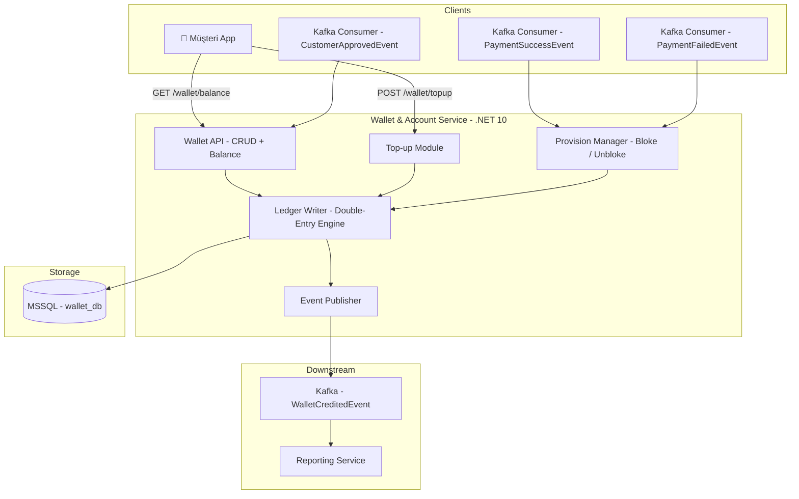
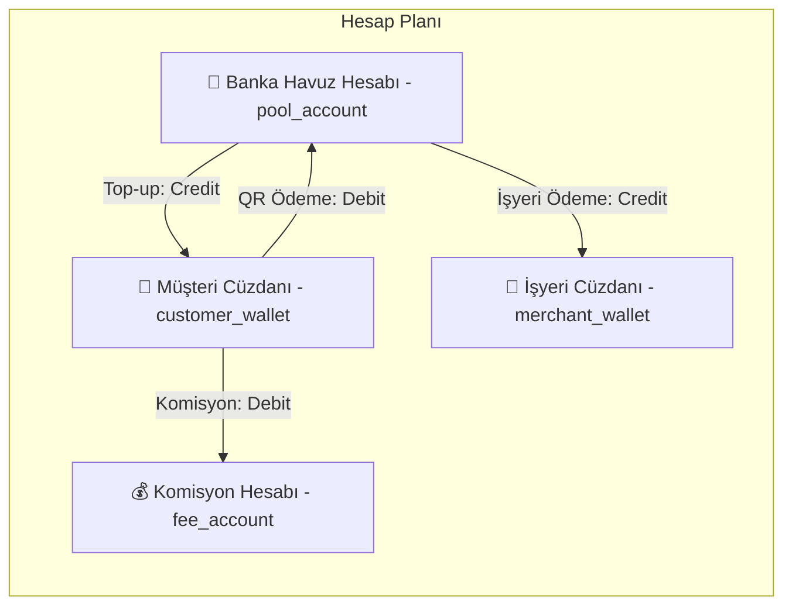
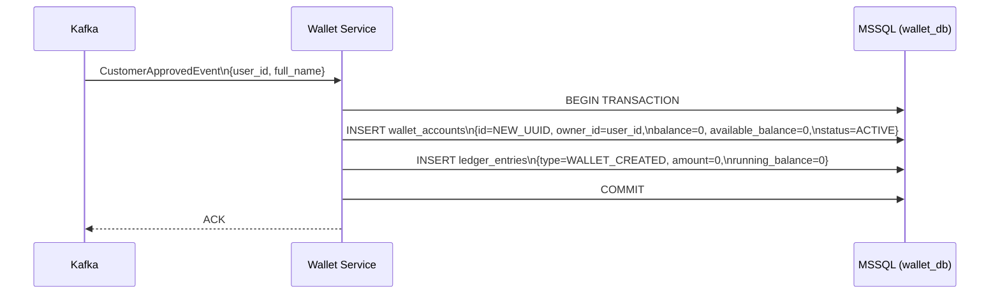
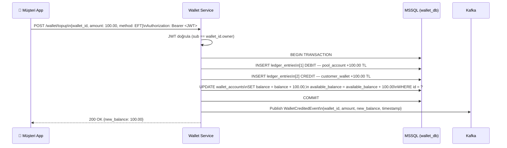
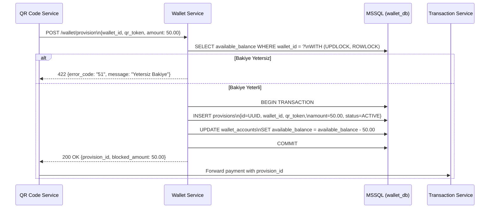
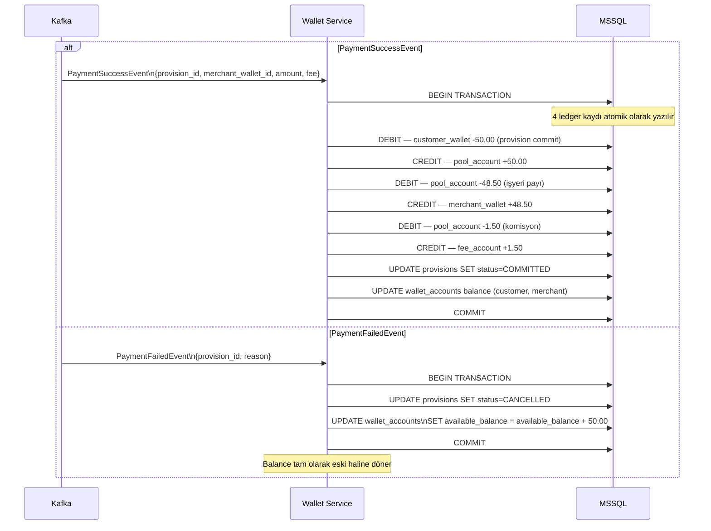
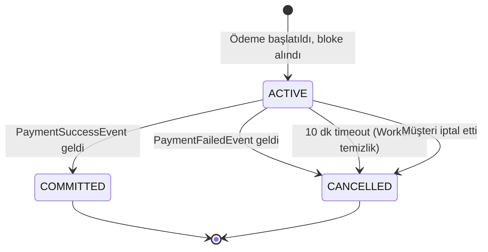

# Wallet & Account Service — Cüzdan Yönetimi ve Çift Taraflı Muhasebe

> **Related Modules:**
> - [`../01-auth-service/`](../01-auth-service/README.md) — Her wallet işlemi JWT doğrulaması gerektirir.
> - [`../02-onboarding-service/`](../02-onboarding-service/README.md) — `CustomerApprovedEvent` ile cüzdan oluşturulur.
> - [`../04-qr-code-service/`](../04-qr-code-service/README.md) — QR tarama sonrası wallet'tan bloke alınır.
> - [`../05-transaction-service/`](../05-transaction-service/README.md) — `PaymentSuccessEvent` ile bloke kesinleşir.
> - [`../09-data-models/`](../09-data-models/README.md) — Double-Entry ER diyagramı.

---

## 1. Purpose & Scope (Amaç ve Kapsam)

Wallet Service, sistemdeki tüm para hareketlerinin tek kaynağı (single source of truth) olduğu finansal çekirdek servistir. Her kuruşun nereden gelip nereye gittiğini, tutarlı ve geri döndürülemez bir şekilde kaydeder. Sistemin finansal bütünlüğü bu servise bağlıdır.

**Temel prensipler:**

| Prensip | Uygulama |
|---|---|
| **Double-Entry Bookkeeping** | Her para hareketi eş zamanlı Debit + Credit kaydıyla gerçekleşir. |
| **ACID Transactions** | Aynı DB transaction'ı içinde iki kayıt atomik olarak yazılır veya hiç yazılmaz. |
| **Immutable Ledger** | Ledger kayıtları asla güncellenmez veya silinmez; yalnızca ters kayıt (reversal) eklenir. |
| **Bloke / Provision** | Ödeme onaylanmadan önce tutar geçici olarak bloke alınır. |

**Kapsam dahilindeki sorumluluklar:**

- Cüzdan oluşturma ve yaşam döngüsü yönetimi
- Bakiye yükleme (Top-up) — kredi kartı veya Havale/EFT
- Bloke (Provision) alma ve kaldırma
- Ödeme kesinleşmesi (Provision → Debit commit)
- Havuz hesabı (Bank Pool Account) yönetimi
- Bakiye sorgulama

**Kapsam dışı:**
- QR üretme → `04-qr-code-service`
- ISO 8583 mesajlaşması → `05-transaction-service`
- Mutabakat raporları → `06-reporting-service`

---

## 2. Architecture & Bounded Context (Mimari ve Sınırlar)



### Double-Entry Hesap Planı



---

## 3. Data Flow & Actors (Veri Akışı ve Aktörler)

### 3.1 Cüzdan Oluşturma (Onboarding Event)



### 3.2 Bakiye Yükleme (Top-up)



### 3.3 Bloke Alma (Provision — QR Ödeme Başlatma)



### 3.4 Bloke Kesinleştirme veya İptal (Commit / Rollback)



---

## 4. Dependencies & Integrations (Bağımlılıklar)

| Bileşen | Teknoloji | Kullanım Amacı |
|---|---|---|
| **Veritabanı** | MSSQL Server | ACID garantili finansal kayıtlar. |
| **Message Broker** | Apache Kafka | Event consume (Onboarding, Transaction) ve publish (WalletCredited). |
| **Auth** | JWT (RS256) | Her API isteğinde token doğrulama. |
| **Locking** | MSSQL `UPDLOCK + ROWLOCK` | Eş zamanlı bakiye güncellemelerinde race condition önleme. |

### MSSQL Şema — Wallet DB

```sql
-- Cüzdan Hesapları
CREATE TABLE wallet_accounts (
    id                  UNIQUEIDENTIFIER PRIMARY KEY DEFAULT NEWID(),
    owner_id            UNIQUEIDENTIFIER NOT NULL,       -- user_id (customer) veya merchant_id
    owner_type          VARCHAR(20) NOT NULL,            -- customer | merchant | pool | fee
    balance             DECIMAL(18,2) NOT NULL DEFAULT 0,
    available_balance   DECIMAL(18,2) NOT NULL DEFAULT 0, -- balance - active_provisions
    currency            CHAR(3) NOT NULL DEFAULT 'TRY',
    status              VARCHAR(20) NOT NULL DEFAULT 'ACTIVE',
    created_at          DATETIME2 NOT NULL DEFAULT GETUTCDATE(),

    CONSTRAINT chk_balance_positive CHECK (balance >= 0),
    CONSTRAINT chk_available_positive CHECK (available_balance >= 0),
    CONSTRAINT chk_available_lte_balance CHECK (available_balance <= balance)
);

-- Değiştirilemez Ledger (Muhasebe Defteri)
CREATE TABLE ledger_entries (
    id              BIGINT IDENTITY PRIMARY KEY,         -- Sıralı, değiştirilemez
    transaction_id  UNIQUEIDENTIFIER NOT NULL,           -- Aynı işlemin Debit+Credit kayıtlarını gruplar
    account_id      UNIQUEIDENTIFIER NOT NULL REFERENCES wallet_accounts(id),
    entry_type      CHAR(6) NOT NULL,                    -- DEBIT | CREDIT
    amount          DECIMAL(18,2) NOT NULL,
    running_balance DECIMAL(18,2) NOT NULL,              -- O anki hesap bakiyesi
    description     NVARCHAR(500),
    reference_type  VARCHAR(50),                         -- TOPUP | QR_PAYMENT | REVERSAL | FEE
    reference_id    NVARCHAR(100),                       -- qr_token, provision_id vb.
    created_at      DATETIME2 NOT NULL DEFAULT GETUTCDATE()
);

-- Geçici Bloke Kayıtları
CREATE TABLE provisions (
    id              UNIQUEIDENTIFIER PRIMARY KEY DEFAULT NEWID(),
    wallet_id       UNIQUEIDENTIFIER NOT NULL REFERENCES wallet_accounts(id),
    qr_token        UNIQUEIDENTIFIER NOT NULL,
    amount          DECIMAL(18,2) NOT NULL,
    status          VARCHAR(20) NOT NULL DEFAULT 'ACTIVE', -- ACTIVE | COMMITTED | CANCELLED
    created_at      DATETIME2 NOT NULL DEFAULT GETUTCDATE(),
    resolved_at     DATETIME2
);
```

---

## 5. Failure Scenarios & Resiliency (Hata Senaryoları)

### 5.1 Provision Durumları



### 5.2 Hata Matrisi

| Senaryo | Etki | Çözüm |
|---|---|---|
| **Yetersiz Bakiye** | `available_balance < amount` | `422` döner, provision oluşturulmaz. |
| **Duplicate Provision** | Aynı `qr_token`'a ikinci bloke | `UNIQUE constraint` üzerinde `qr_token` indexi; `409 Conflict`. |
| **MSSQL Transaction Deadlock** | Eş zamanlı UPDATE çakışması | MSSQL retry logic; `SNAPSHOT ISOLATION LEVEL` tercih. |
| **Kafka Event Kaybı** | Ledger güncellenmez | Outbox Pattern; `ledger_entries` Outbox tablosu eşlik eder. |
| **Stale Provision** | QR süresi doldu, provision açık kaldı | Background Worker: `SELECT * FROM provisions WHERE status=ACTIVE AND created_at < NOW()-10min` → CANCEL. |

---

## 6. Security & Compliance (Güvenlik)

| Konu | Uygulama |
|---|---|
| **Row-Level Locking** | `WITH (UPDLOCK, ROWLOCK)` — bakiye güncellemesinde satır kilidi. |
| **Balance Constraint** | DB CHECK constraint: `balance >= 0` — negatif bakiye DB katmanında imkânsız. |
| **Ledger Immutability** | Ledger tablosunda `UPDATE` ve `DELETE` yetkisi uygulama kullanıcısından kaldırılmış. |
| **Audit Trail** | Her ledger kaydında `transaction_id` ile tam iz sürülebilirlik. |
| **Separation of Duties** | Pool Account yalnızca Wallet Service'in internal hesabı; müşteri/merchant erişimi yok. |


