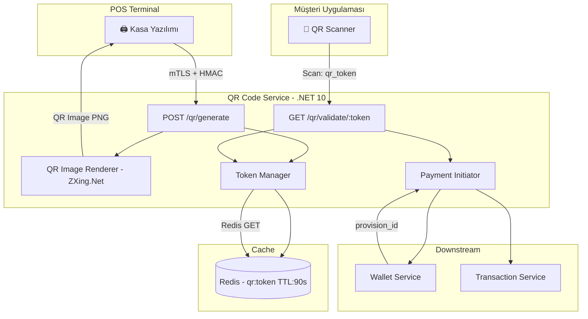
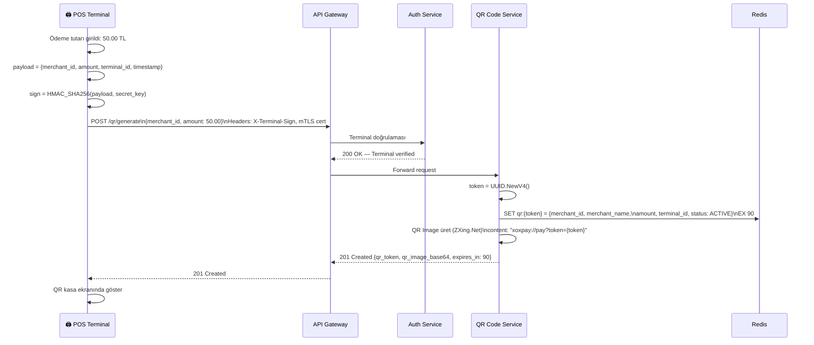
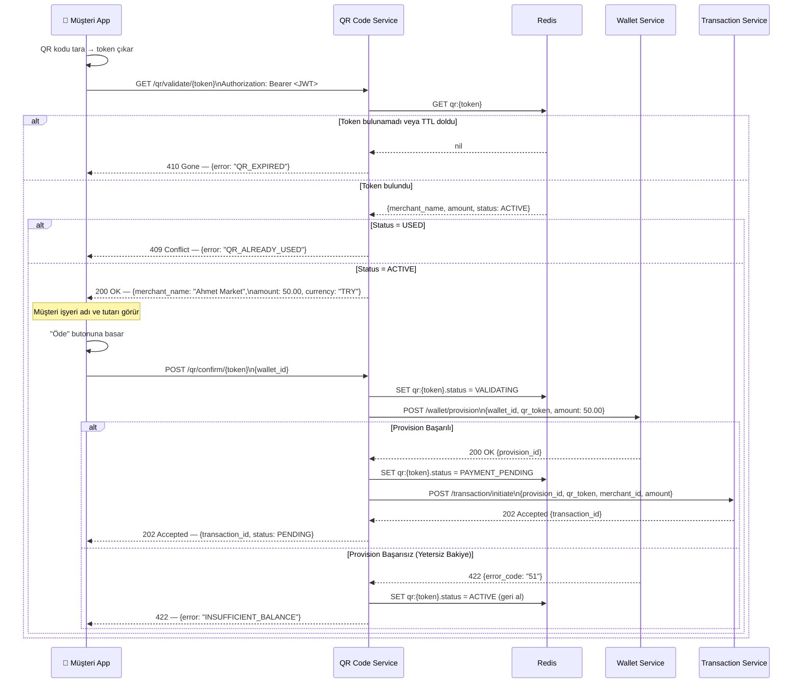
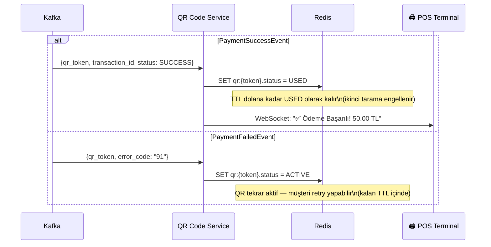
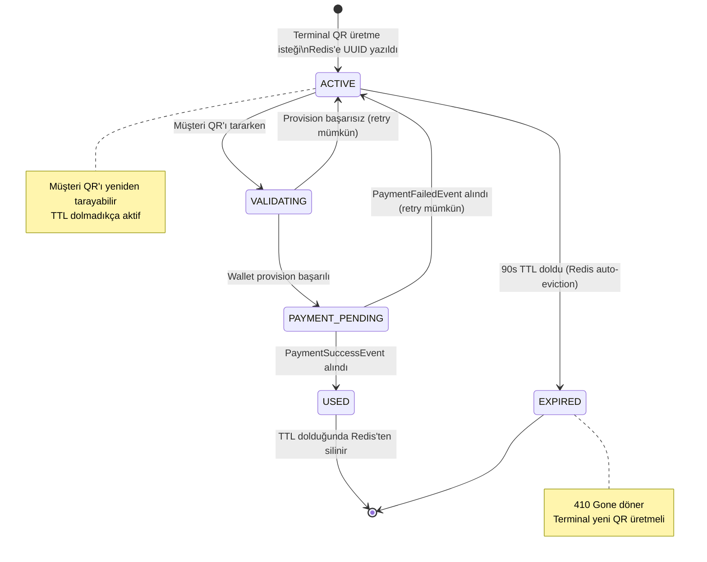

# QR Code Service — Dinamik QR Üretimi ve Yaşam Döngüsü Yönetimi

> **Related Modules:**
> - [`../01-auth-service/`](../01-auth-service/README.md) — Terminal, mTLS + HMAC ile QR üretme yetkisi alır.
> - [`../03-wallet-service/`](../03-wallet-service/README.md) — QR tarandıktan sonra Wallet'a Provision isteği gönderilir.
> - [`../05-transaction-service/`](../05-transaction-service/README.md) — Provision başarılıysa Transaction Service devreye girer.
> - [`../07-infrastructure/`](../07-infrastructure/README.md) — Redis TTL konfigürasyonu ve eviction policy.

---

## 1. Purpose & Scope (Amaç ve Kapsam)

QR Code Service, her ödeme işlemi için **benzersiz, kısa ömürlü ve güvenli** bir QR token üretir. QR içeriğinde finansal veri **taşınmaz**; yalnızca Redis'teki bir kayda işaret eden UUID token bulunur. Bu tasarım, QR'ın ele geçirilmesi durumunda bile finansal bilginin ifşa olmamasını garanti eder.

**Temel prensipler:**

| Prensip | Açıklama |
|---|---|
| **Veri Yalıtımı** | QR payload'ı yalnızca `qr_token` (UUID) içerir; tutar, işyeri adı QR'da yer almaz. |
| **Kısa Ömür** | 90 saniye Redis TTL; süre dolduğunda token otomatik silinir, QR geçersizleşir. |
| **Tek Kullanımlık** | Token bir kez `Used` durumuna geçtikten sonra tekrar kullanılamaz. |
| **Terminal Bağlantısı** | Her QR, onu üreten `terminal_id`'ye bağlıdır; başka bir terminalden kullanılamaz. |

**Kapsam dahilindeki sorumluluklar:**
- Dinamik QR token üretimi (UUID v4)
- Redis'e token yazma (TTL ile)
- Müşteri tarafından QR taranınca token doğrulama
- Token durumu yönetimi (Active → Used / Expired)
- İşlem bilgisi görüntüleme (işyeri adı, tutar) — token aracılığıyla

**Kapsam dışı:**
- Terminal kimlik doğrulaması → `01-auth-service`
- Ödeme onayı ve para hareketi → `03-wallet-service`, `05-transaction-service`

---

## 2. Architecture & Bounded Context (Mimari ve Sınırlar)



### Redis Veri Modeli

```
Key:   qr:{uuid-token}
TTL:   90 seconds
Value: {
    "terminal_id":   "TERM-001",
    "merchant_id":   "MERCH-XOX-999",
    "merchant_name": "Ahmet Market",
    "amount":        50.00,
    "currency":      "TRY",
    "created_at":    "2026-05-25T18:00:00Z",
    "status":        "ACTIVE"
}
```

> **Neden Finansal Veri Redis'te?** QR payload'ında değil, Redis'te tutulur. Redis, API Gateway'in arkasındadır ve doğrudan müşteriye açık değildir. QR'daki UUID yalnızca bir **referans anahtarıdır**; bu sayede QR kamerasıyla yakalanmış olsa bile içindeki token tek başına finansal bir işlem tetikleyemez — Auth doğrulaması şarttır.

---

## 3. Data Flow & Actors (Veri Akışı ve Aktörler)

### 3.1 QR Üretim Akışı (Terminal → QR Service)



### 3.2 QR Tarama ve Doğrulama Akışı (Müşteri → Ödeme)



### 3.3 Ödeme Sonucu ve QR Token Kapatma



### 3.4 QR Yaşam Döngüsü (State Machine)



---

## 4. Dependencies & Integrations (Bağımlılıklar)

| Bileşen | Teknoloji | Kullanım Amacı |
|---|---|---|
| **Cache** | Redis (TTL + Atomic SET) | Token depolama, 90s ömür, durum yönetimi. |
| **Auth** | mTLS + HMAC-SHA256 | Terminal yetkilendirmesi (API Gateway'de). |
| **QR Render** | `ZXing.Net` (.NET) | QR kod görseli üretimi (PNG/SVG). |
| **Wallet Service** | HTTP (internal) | Provision alma; timeout: 5 saniye. |
| **Transaction Service** | HTTP (internal) | Ödeme başlatma. |
| **Kafka Consumer** | Apache Kafka | `PaymentSuccessEvent` ve `PaymentFailedEvent` consume. |
| **WebSocket** | ASP.NET SignalR | Kasaya anlık ödeme bildirimi. |

---

## 5. Failure Scenarios & Resiliency (Hata Senaryoları)

| Senaryo | Etki | Çözüm |
|---|---|---|
| **Redis erişilemiyor** | QR üretilemiyor | Circuit Breaker açılır; terminal `503 Service Unavailable`. |
| **Redis eviction (memory-full)** | Aktif token silinebilir | `allkeys-lru` yerine `volatile-lru` eviction policy (sadece TTL'li keyler evict edilir). |
| **QR taramada Race Condition** | İki müşteri aynı QR'ı aynı anda tarar | Redis `SET qr:{token}.status = VALIDATING NX` — atomik; yalnızca biri başarılı olur. |
| **Wallet timeout (>5sn)** | Provision alınamadı | QR `ACTIVE` durumuna döner; müşteriye retry önerilir. |
| **Transaction Service unavailable** | Provision alındı ama işlem başlamadı | Stale provision background worker tarafından 10 dk sonra CANCEL edilir. |
| **WebSocket bağlantı koptu** | POS bildirim alamadı | POS, `GET /transaction/status/{transaction_id}` ile polling yapabilir (fallback). |

---

## 6. Security & Compliance (Güvenlik)

| Konu | Uygulama |
|---|---|
| **QR İçerik Güvenliği** | Finansal veri QR'da yok; yalnızca `xoxpay://pay?token={uuid}` URI formatı. |
| **Token Tahmin Edilemezliği** | UUID v4 (122-bit rastgelelik); brute-force ile tahmin imkânsız. |
| **Replay Attack** | Token bir kez USED olunca Redis'te kalır (TTL dolana kadar) ve reddedilir. |
| **QR Hijacking** | Token + JWT birlikte gerekli; QR tek başına işlem başlatamaz. |
| **Kasa Güvenliği** | Terminal mTLS + HMAC; sahte terminal QR üretemez. |
| **Deep Link Scheme** | `xoxpay://` scheme yalnızca resmi uygulamada registered; başka uygulama handle edemez. |

---

## 7. Research & Open Questions (Yeni Başlayanlar İçin Araştırma Rehberi)

> Bu bölüm, cache sistemleri ve QR tabanlı ödeme akışlarına yeni başlayan backend geliştiriciler için hazırlanmıştır.
> Her madde; **ne öğreneceğini**, **neden önemli olduğunu** ve **nereden başlayacağını** gösterir.

---

- **📚 Redis nedir ve neden veritabanı yerine Redis kullandık?**
  QR token'ları MSSQL'de değil Redis'te tutuluyor. Neden? Her ikisi de veri saklar, farkı ne?
  - Redis bir "in-memory" veri deposudur — disk yerine RAM'de çalışır. Bu ne kadar hız farkı yaratır?
  - **TTL (Time To Live)** kavramını araştır: Redis'te bir key'e `EX 90` yazarsan, 90 saniye sonra Redis onu **otomatik siler**. Bunu MSSQL'de yapmak için ne gerekir?
  - **Anahtar soru:** Redis sunucusu yeniden başlatılırsa veriler ne olur? QR token'lar kaybolursa sistem ne yapmalı?

---

- **📚 QR kod içinde neden para miktarı yazmıyor?**
  "Static QR" ile "Dynamic QR" arasındaki farkı ve neden bu sistemde dinamik QR tercih edildiğini anlamak kritik bir güvenlik konusudur.
  - Static QR'da ne olur? Müşteri QR'ı fotoğraflayıp kaydederse, aynı QR ile tekrar ödeme yapabilir mi?
  - Bu sistemde QR yalnızca bir UUID taşıyor. Birisi QR'ı kopyalasa ne işine yarar? (Cevap: JWT olmadan hiçbir şey yapamaz)
  - **Anahtar soru:** Neden QR içindeki UUID yerine doğrudan `amount=50&merchant=Ahmet` yazmıyoruz? Bu bilgiyi QR'dan okusak ne riski doğar?

---

- **📚 Race Condition nedir? Aynı QR'ı iki kişi aynı anda taradığında ne olur?**
  İki müşteri aynı saniyede aynı QR'ı tarayabilir mi? Olabilir! Bu "race condition" örneğidir.
  - Redis `SET NX` (SET if Not eXists) komutunu araştır. Atomic işlemin ne anlama geldiğini anla.
  - `SET key value NX` sadece key yoksa yazar — bu operasyonu iki client aynı anda yaparsa yalnızca biri kazanır.
  - **Dene:** Redis CLI'da `SET qr:test VALIDATING NX EX 90` komutunu iki kez çalıştır. İkinci komut ne döndürür?

---

- **📚 UUID nedir? Neden random ID kullanıyoruz?**
  Token olarak `8f3b9a2c-d91e-4a2b-b3c1-7f9e2d4a8c3b` gibi bir UUID üretiyoruz. Neden `1, 2, 3` gibi sıralı ID kullanmıyoruz?
  - UUID v4 (122-bit random) ile tahmin edilebilir sıralı ID arasındaki güvenlik farkını araştır.
  - Eğer token `1, 2, 3` olsaydı, bir saldırgan henüz ödenmemiş başka işlemleri tahmin edip deneyebilir miydi?
  - **Anahtar soru:** `NEWID()` (MSSQL) veya `Guid.NewGuid()` (.NET) cryptographically random mi? Bu neden önemli?

---

- **📚 WebSocket nedir? Kasa neden polling yapmıyor?**
  Ödeme tamamlandığında kasa ekranı anında "✅ Ödeme Başarılı!" gösteriyor. Kasa bu bilgiyi nasıl alıyor?
  - "Polling" ile "WebSocket (Push)" arasındaki farkı araştır: Her 2 saniyede `GET /status` çağırmak yerine sunucunun mesaj göndermesi.
  - ASP.NET SignalR'ın WebSocket üzerindeki soyutlamasını incele.
  - **Anahtar soru:** WebSocket bağlantısı koptuğunda (müşteri Wi-Fi değiştirdi) kasa ödemeyi başarılı mı yoksa başarısız mı saymalı? Fallback mekanizması ne olmalı?

