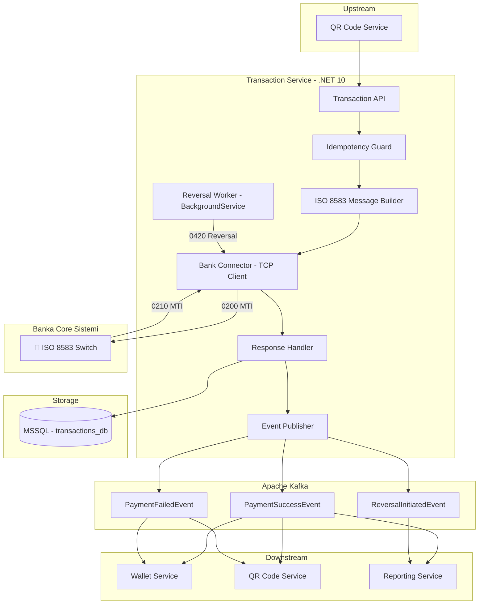
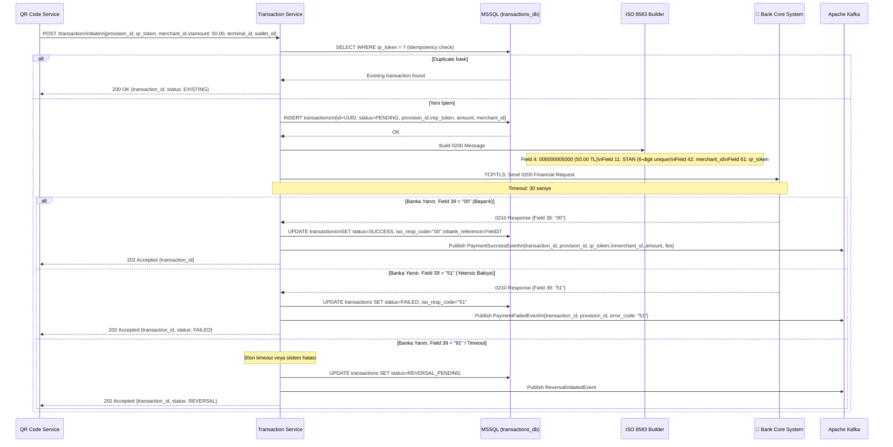
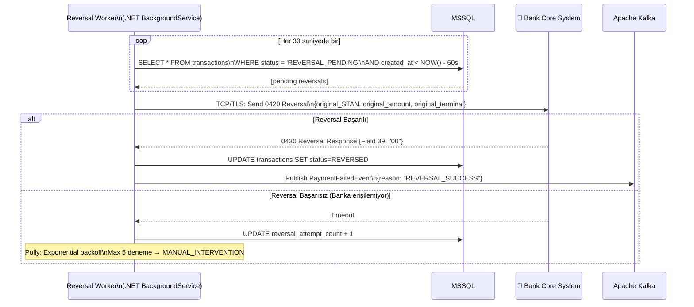
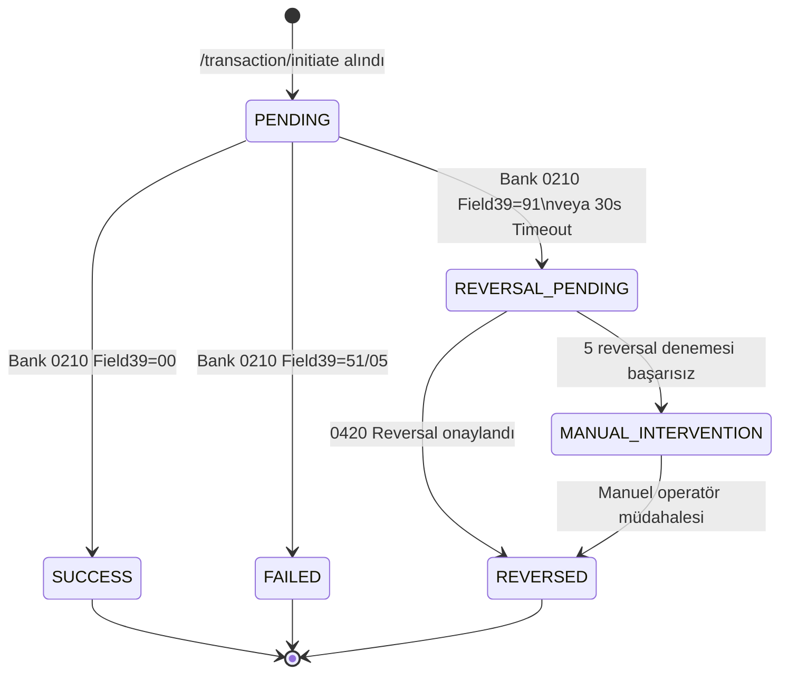

# Transaction Service — ISO 8583 Ödeme Akışı ve Event-Driven Yönetim

> **Related Modules:**
> - [`../03-wallet-service/`](../03-wallet-service/README.md) — Provision bilgisi buradan gelir; sonuç event ile wallet'a iletilir.
> - [`../04-qr-code-service/`](../04-qr-code-service/README.md) — QR Service ödeme işlemini tetikler.
> - [`../06-reporting-service/`](../06-reporting-service/README.md) — İşlem eventlerini tüketerek raporlar üretir.
> - [`../07-infrastructure/`](../07-infrastructure/README.md) — Kafka topic konfigürasyonu.
> - [`../11-adr/`](../11-adr/README.md) — ADR-003: ISO 8583 .NET library seçimi.

---

## 1. Purpose & Scope (Amaç ve Kapsam)

Transaction Service, ödeme sürecinin **bankacılık çekirdeğiyle** konuşan tek servistir. ISO 8583 protokolünü kullanarak Banka Core Sistemine finansal mesajlar iletir, yanıtı işler ve sonucu Kafka üzerinden tüm downstream servislere yayınlar.

**Temel prensipler:**

| Prensip | Açıklama |
|---|---|
| **ISO 8583 Uyumu** | `0200` Financial Request, `0210` Response, `0420` Reversal mesajları. |
| **Idempotency** | Her işlem benzersiz `STAN` + `transaction_id` taşır; aynı istek defalarca gönderilse de tek kez işlenir. |
| **Asenkron Sonuç** | Banka yanıtı geldiğinde Kafka'ya event publish edilir; servisler kendi hızlarında tükenir. |
| **Reversal Mekanizması** | Timeout veya hata durumunda otomatik `0420 Reversal` tetiklenir. |

**Kapsam dahilindeki sorumluluklar:**
- ISO 8583 mesaj oluşturma ve ayrıştırma
- Banka Core Sistemine TCP/TLS bağlantısı
- `0200` gönderme, `0210` bekleme (timeout: 30sn)
- Başarı/Başarısızlık eventleri Kafka'ya yayınlama
- `0420 Reversal` mesajı ve retry yönetimi
- İşlem durumu takibi (MSSQL)

**Kapsam dışı:**
- Bakiye kontrolü ve bloke → `03-wallet-service`
- QR token doğrulama → `04-qr-code-service`
- Mutabakat ve raporlama → `06-reporting-service`

---

## 2. Architecture & Bounded Context (Mimari ve Sınırlar)



---

## 3. Data Flow & Actors (Veri Akışı ve Aktörler)

### 3.1 Ödeme İşlemi Ana Akışı (Happy Path)



### 3.2 Reversal (0420) Akışı



### 3.3 İşlem Durum Makinesi



### 3.4 ISO 8583 Mesaj Yapısı (Detaylı)

```mermaid
graph LR
    subgraph Request [0200 - Financial Transaction Request]
        R1[MTI: 0200]
        R2["Field 2: PAN - Masked wallet_id"]
        R3["Field 3: Processing Code - 000000 Purchase"]
        R4["Field 4: Amount - 000000005000"]
        R5["Field 7: Transmission DateTime - MMDDhhmmss"]
        R6["Field 11: STAN - 123456"]
        R7["Field 12: Local Time - hhmmss"]
        R8["Field 13: Local Date - MMDD"]
        R9["Field 18: MCC - 5411 Grocery"]
        R9b["Field 22: POS Entry Mode - 033 QR Scan"]
        R10["Field 37: Retrieval Ref No - 12-char"]
        R11["Field 41: Terminal ID - TERM-001"]
        R12["Field 42: Merchant ID - MERCH-XOX-999"]
        R13["Field 43: Merchant Name - Ahmet Market"]
        R14["Field 49: Currency Code - 949 TRY"]
        R15["Field 61: QR Token - uuid..."]
    end

    subgraph Response [0210 - Financial Transaction Response]
        P1[MTI: 0210]
        P2["Field 39: Response Code - 00/51/91/05"]
        P3["Field 38: Auth Code - onay kodu"]
        P4["Field 37: Retrieval Ref No - Echo"]
        P5[Field 11: STAN Echo]
    end
```



---

## 4. Dependencies & Integrations (Bağımlılıklar)

| Bileşen | Teknoloji | Kullanım Amacı |
|---|---|---|
| **Veritabanı** | MSSQL Server | İşlem kaydı, idempotency check, reversal tracking. |
| **Banka Bağlantısı** | TCP/TLS (Özel port) | ISO 8583 mesaj iletimi; keepalive bağlantı havuzu. |
| **ISO 8583 Parser** | `.NET 10` custom parser veya `OpenIso8583.Net` | Mesaj oluşturma ve ayrıştırma. |
| **Message Broker** | Apache Kafka | `PaymentSuccessEvent`, `PaymentFailedEvent`, `ReversalInitiatedEvent`. |
| **Resiliency** | `Polly` (.NET) | Retry (exponential backoff), Circuit Breaker, Timeout politikaları. |
| **Idempotency** | MSSQL `UNIQUE(qr_token)` | Aynı QR token'a çift işlem engeli. |

### MSSQL Şema — Transactions DB

```sql
CREATE TABLE transactions (
    id                      UNIQUEIDENTIFIER PRIMARY KEY DEFAULT NEWID(),
    qr_token                UNIQUEIDENTIFIER NOT NULL UNIQUE,    -- Idempotency key
    provision_id            UNIQUEIDENTIFIER NOT NULL,
    customer_wallet_id      UNIQUEIDENTIFIER NOT NULL,
    merchant_id             NVARCHAR(64) NOT NULL,
    terminal_id             NVARCHAR(64) NOT NULL,
    amount                  DECIMAL(18,2) NOT NULL,
    fee                     DECIMAL(18,2) NOT NULL DEFAULT 0,
    currency                CHAR(3) NOT NULL DEFAULT 'TRY',
    status                  VARCHAR(30) NOT NULL,                -- PENDING | SUCCESS | FAILED | REVERSAL_PENDING | REVERSED | MANUAL_INTERVENTION
    iso_resp_code           VARCHAR(4),                          -- Field 39: 00, 51, 91, 05
    stan                    VARCHAR(6),                          -- System Trace Audit Number
    bank_reference          VARCHAR(12),                         -- Field 37 echo
    auth_code               VARCHAR(6),                          -- Field 38 (başarılı işlemlerde)
    reversal_attempt_count  TINYINT NOT NULL DEFAULT 0,
    created_at              DATETIME2 NOT NULL DEFAULT GETUTCDATE(),
    updated_at              DATETIME2 NOT NULL DEFAULT GETUTCDATE(),
    completed_at            DATETIME2
);

CREATE TABLE kafka_outbox (
    id              BIGINT IDENTITY PRIMARY KEY,
    event_type      NVARCHAR(100) NOT NULL,
    payload         NVARCHAR(MAX) NOT NULL,         -- JSON
    topic           NVARCHAR(200) NOT NULL,
    is_published    BIT NOT NULL DEFAULT 0,
    created_at      DATETIME2 NOT NULL DEFAULT GETUTCDATE(),
    published_at    DATETIME2
);
```

---

## 5. Failure Scenarios & Resiliency (Hata Senaryoları)

### 5.1 Hata Matrisi

| Senaryo | Field 39 | Sistem Aksiyonu |
|---|---|---|
| **Başarılı** | `00` | Provision COMMIT, Wallet'a kredi, Makbuz üretimi. |
| **Yetersiz Bakiye** | `51` | Provision iptal, Müşteriye bildirim. |
| **Genel Red** | `05` | İşlem iptal, loglama. |
| **Sistem Hatası** | `91` | `0420 Reversal` tetiklenir, Provision iptal. |
| **Banka Timeout (30sn)** | — | `0420 Reversal` tetiklenir, status=`REVERSAL_PENDING`. |
| **Reversal Başarısız (5 deneme)** | — | `MANUAL_INTERVENTION`, ops ekibine alert. |
| **Kafka publish başarısız** | — | `kafka_outbox` tablosuna yazılır, worker retry. |

### 5.2 Polly Konfigürasyonu

```csharp
// Bank Connector — Polly politikaları
var retryPolicy = Policy
    .Handle<SocketException>()
    .Or<TimeoutException>()
    .WaitAndRetryAsync(
        retryCount: 2,
        sleepDurationProvider: attempt => TimeSpan.FromSeconds(Math.Pow(2, attempt)),
        onRetry: (ex, ts, attempt, ctx) =>
            logger.LogWarning("Bank retry {Attempt}", attempt)
    );

var circuitBreakerPolicy = Policy
    .Handle<Exception>()
    .CircuitBreakerAsync(
        exceptionsAllowedBeforeBreaking: 5,
        durationOfBreak: TimeSpan.FromSeconds(60),
        onBreak: (ex, ts) => logger.LogError("Circuit OPEN for 60s"),
        onReset: () => logger.LogInformation("Circuit CLOSED")
    );

var timeoutPolicy = Policy.TimeoutAsync(30); // 30 saniye hard limit

var combined = Policy.WrapAsync(retryPolicy, circuitBreakerPolicy, timeoutPolicy);
```

---

## 6. Security & Compliance (Güvenlik)

| Konu | Uygulama |
|---|---|
| **Banka Bağlantısı** | TLS 1.2+ zorunlu; sertifika pinning uygulanır. |
| **PAN Maskeleme** | Log'larda `wallet_id` masked: `****-****-****-1234`. |
| **STAN Benzersizliği** | Her gün sıfırlanan 6 haneli sıralı numara; günlük 999,999 işlem sınırı. |
| **Idempotency** | `qr_token` üzerinde DB UNIQUE constraint; double-charge imkânsız. |
| **Audit Trail** | Her durum değişikliği `updated_at` ile kaydedilir; tam iz sürülebilirlik. |
| **PCI-DSS Uyumu** | Kart verisi işlenmediği için kapsam dışı; yalnızca wallet_id kullanılır. |


