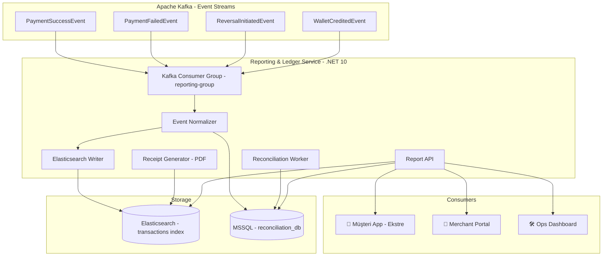
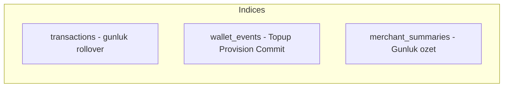
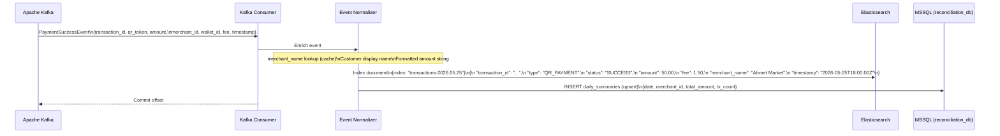
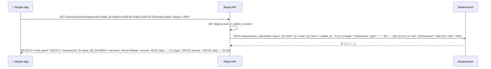
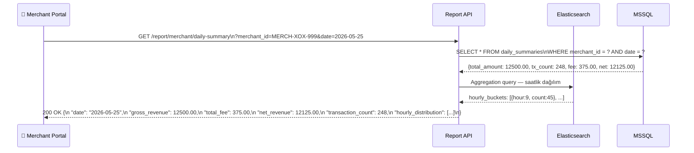
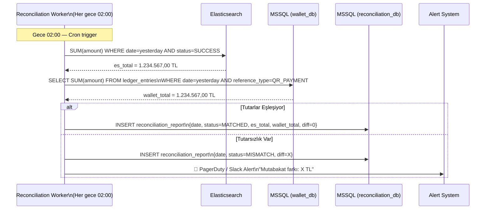
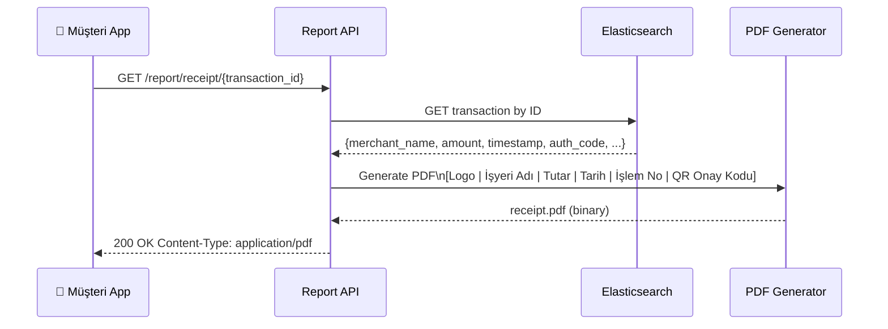

# Reporting & Ledger Service — Mutabakat, Raporlama ve Makbuz Üretimi

> **Related Modules:**
> - [`../03-wallet-service/`](../03-wallet-service/README.md) — Ledger eventleri buradan tüketilir.
> - [`../05-transaction-service/`](../05-transaction-service/README.md) — `PaymentSuccessEvent`, `ReversalInitiatedEvent` consume edilir.
> - [`../07-infrastructure/`](../07-infrastructure/README.md) — Kafka consumer group konfigürasyonu, Elasticsearch setup.
> - [`../09-data-models/`](../09-data-models/README.md) — Reporting veri modeli ve sorgu optimizasyonları.

---

## 1. Purpose & Scope (Amaç ve Kapsam)

Reporting & Ledger Service, sistemin **geriye dönük hafızasıdır**. İşlem eventlerini Kafka'dan tüketerek sorgulama için optimize edilmiş bir veri deposuna yazar; düzenli mutabakat (reconciliation) yapar ve tüm taraflara (müşteri, merchant, operasyon ekibi) anlamlı raporlar sunar.

**Temel prensipler:**

| Prensip | Açıklama |
|---|---|
| **Read-Optimized** | Ledger Service write-heavy sistemden ayrı; Elasticsearch ile hızlı tam-metin arama. |
| **Eventual Consistency** | Kafka event'leri tüketilir; veriler milisaniyeler içinde (gerçek zamanlıya yakın) raporlanır. |
| **Immutable Events** | Kafka'dan gelen event'ler aynen saklanır; düzeltme yeni event ile yapılır. |
| **Daily Reconciliation** | Her gece banka ve wallet bakiyeleri karşılaştırılır; fark varsa uyarı üretilir. |

**Kapsam dahilindeki sorumluluklar:**
- Kafka consumer: `PaymentSuccessEvent`, `PaymentFailedEvent`, `ReversalInitiatedEvent`, `WalletCreditedEvent`
- Elasticsearch'e olay yazma ve indeksleme
- Müşteri ekstresi (özet ve detay)
- Merchant gün sonu raporu
- Operasyon dashboardı (işlem hacimleri, hata oranları)
- Dijital makbuz üretimi (PDF)
- Günlük mutabakat (Daily Reconciliation)

**Kapsam dışı:**
- Para hareketi ve bakiye → `03-wallet-service`
- ISO 8583 işlemi → `05-transaction-service`

---

## 2. Architecture & Bounded Context (Mimari ve Sınırlar)



### Elasticsearch Index Mimarisi



---

## 3. Data Flow & Actors (Veri Akışı ve Aktörler)

### 3.1 Event Tüketimi ve Yazma Akışı



### 3.2 Müşteri Ekstresi Sorgusu



### 3.3 Merchant Gün Sonu Raporu



### 3.4 Günlük Mutabakat (Daily Reconciliation)



### 3.5 Dijital Makbuz Üretimi



---

## 4. Dependencies & Integrations (Bağımlılıklar)

| Bileşen | Teknoloji | Kullanım Amacı |
|---|---|---|
| **Event Tüketimi** | Apache Kafka | Tüm ödeme olaylarını consume etme. |
| **Arama Motoru** | Elasticsearch | Hızlı filtreleme, agregasyon, özet sorgular. |
| **İlişkisel Veri** | MSSQL Server | Mutabakat tabloları, günlük özetler. |
| **PDF Üretimi** | `QuestPDF` (.NET) | Dijital makbuz oluşturma. |
| **Zamanlama** | .NET BackgroundService + Cron | Gece mutabakat işi. |
| **Cache** | Redis | Merchant adı lookup cache (ES önünde). |

### Elasticsearch Index Mapping (transactions)

```json
{
  "mappings": {
    "properties": {
      "transaction_id":  { "type": "keyword" },
      "qr_token":        { "type": "keyword" },
      "type":            { "type": "keyword" },
      "status":          { "type": "keyword" },
      "wallet_id":       { "type": "keyword" },
      "merchant_id":     { "type": "keyword" },
      "merchant_name":   { "type": "text", "fields": { "keyword": { "type": "keyword" } } },
      "amount":          { "type": "double" },
      "fee":             { "type": "double" },
      "iso_resp_code":   { "type": "keyword" },
      "timestamp":       { "type": "date" }
    }
  }
}
```

### MSSQL Şema — Reconciliation DB

```sql
CREATE TABLE daily_summaries (
    id              BIGINT IDENTITY PRIMARY KEY,
    summary_date    DATE NOT NULL,
    merchant_id     NVARCHAR(64),
    total_amount    DECIMAL(18,2) NOT NULL DEFAULT 0,
    total_fee       DECIMAL(18,2) NOT NULL DEFAULT 0,
    net_amount      DECIMAL(18,2) NOT NULL DEFAULT 0,
    tx_count        INT NOT NULL DEFAULT 0,
    UNIQUE (summary_date, merchant_id)
);

CREATE TABLE reconciliation_reports (
    id              BIGINT IDENTITY PRIMARY KEY,
    report_date     DATE NOT NULL UNIQUE,
    es_total        DECIMAL(18,2) NOT NULL,
    wallet_total    DECIMAL(18,2) NOT NULL,
    difference      DECIMAL(18,2) NOT NULL,
    status          VARCHAR(20) NOT NULL,    -- MATCHED | MISMATCH | PENDING
    created_at      DATETIME2 NOT NULL DEFAULT GETUTCDATE()
);
```

---

## 5. Failure Scenarios & Resiliency (Hata Senaryoları)

| Senaryo | Etki | Çözüm |
|---|---|---|
| **Elasticsearch down** | Raporlar erişilemiyor | Circuit Breaker; MSSQL daily_summaries fallback verisi. |
| **Kafka consumer lag** | Raporlar gecikmeli | Consumer group monitoring (Grafana); lag alert (>1000 msg). |
| **PDF oluşturma hatası** | Makbuz alınamıyor | Async retry; HTML fallback (makbuz yerine ekran görüntüsü). |
| **Mutabakat farkı** | Finansal tutarsızlık | Otomatik alert + detaylı diff raporu; ops manuel incelemesi. |
| **Event kayıp (at-most-once)** | Bazı işlemler raporlanmıyor | `enable.auto.commit=false`; manuel offset commit sonrası yaz. |

---

## 6. Security & Compliance (Güvenlik)

| Konu | Uygulama |
|---|---|
| **Müşteri Verisi Erişimi** | Ekstre sorguları JWT `sub` claim ile wallet_id kontrolü; başkasının verisine erişilemez. |
| **Merchant Verisi İzolasyonu** | Merchant raporları API Key ile kimlik doğrulamalı; başka merchant verisi görülemez. |
| **Elasticsearch Güvenliği** | X-Pack Security aktif; role-based index erişimi. |
| **Veri Saklama Süresi** | İşlem kayıtları MASAK gereği 10 yıl; ES lifecycle policy (hot → warm → cold). |
| **PII Maskeleme** | Elasticsearch'te müşteri adı tokenized; kişisel arama yalnızca admin rolünde. |


