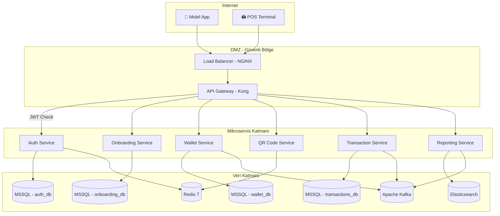
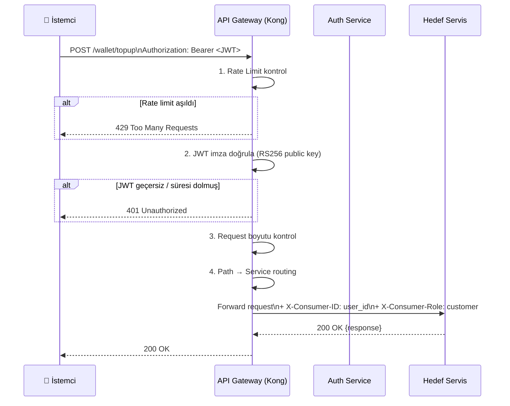
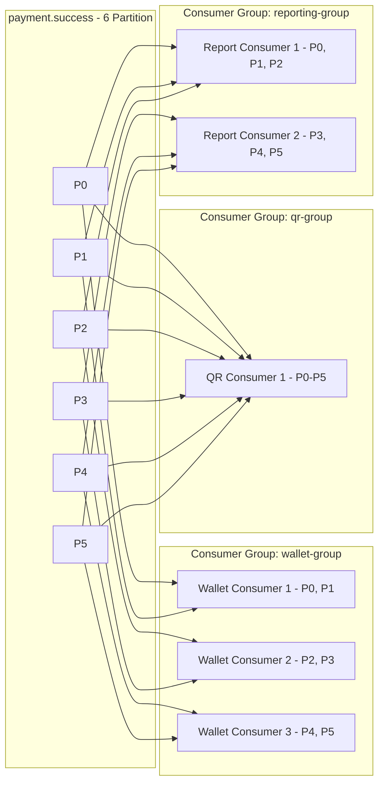

# Infrastructure — API Gateway, Kafka, Redis ve MSSQL Konfigürasyonu

> **Related Modules:**
> - [`../01-auth-service/`](../01-auth-service/README.md) — API Gateway üzerinde JWT doğrulama middleware'i çalışır.
> - [`../04-qr-code-service/`](../04-qr-code-service/README.md) — Redis TTL ve eviction policy buradan yönetilir.
> - [`../05-transaction-service/`](../05-transaction-service/README.md) — Kafka topic tasarımı ve consumer group konfigürasyonu.
> - [`../10-deployment/`](../10-deployment/README.md) — Docker Compose ve Kubernetes manifest dosyaları.

---

## 1. Purpose & Scope (Amaç ve Kapsam)

Bu belge, sistemin tüm mikroservislerinin üzerinde çalıştığı altyapı bileşenlerini kapsar. Her bileşenin rolü, konfigürasyon kararları ve servislerle entegrasyon noktaları açıklanır.

| Bileşen | Rol | Teknoloji |
|---|---|---|
| **API Gateway** | Tek giriş noktası, auth middleware, rate limiting | Kong / AWS API Gateway |
| **Message Broker** | Servisler arası asenkron iletişim | Apache Kafka |
| **Cache** | QR token TTL yönetimi, session cache | Redis 7 |
| **Veritabanı** | ACID garantili finansal kayıtlar | MSSQL Server 2022 |
| **Service Discovery** | Servis adres çözümleme | Kubernetes DNS / Consul |

---

## 2. Architecture & Bounded Context (Mimari)



---

## 3. API Gateway (Kong)

API Gateway tüm dış trafiğin geçtiği tek kapıdır. Servisler dış dünyaya doğrudan açık **değildir**.

### 3.1 Route Konfigürasyonu

```yaml
# kong.yml — Declarative Config
_format_version: "3.0"

services:
  - name: auth-service
    url: http://auth-service:8080
    routes:
      - name: auth-routes
        paths: ["/auth"]
        methods: ["POST"]

  - name: qr-service
    url: http://qr-service:8080
    routes:
      - name: qr-routes
        paths: ["/qr"]
        methods: ["GET", "POST"]
    plugins:
      - name: jwt          # JWT doğrulama plugin
      - name: rate-limiting
        config:
          minute: 60       # QR üretimi: dakikada 60 istek / terminal

  - name: wallet-service
    url: http://wallet-service:8080
    routes:
      - name: wallet-routes
        paths: ["/wallet"]
    plugins:
      - name: jwt
      - name: rate-limiting
        config:
          minute: 30

  - name: transaction-service
    url: http://transaction-service:8080
    routes:
      - name: transaction-routes
        paths: ["/transaction"]
    plugins:
      - name: jwt
      - name: request-size-limiting
        config:
          allowed_payload_size: 1  # max 1 MB

  - name: reporting-service
    url: http://reporting-service:8080
    routes:
      - name: report-routes
        paths: ["/report"]
    plugins:
      - name: jwt
```

### 3.2 Gateway Middleware Akışı



---

## 4. Apache Kafka — Topic Tasarımı

### 4.1 Topic Listesi

| Topic Adı | Producer | Consumer(lar) | Partition | Retention |
|---|---|---|---|---|
| `customer.approved` | Onboarding | Auth, Wallet | 3 | 7 gün |
| `merchant.approved` | Onboarding | Auth | 3 | 7 gün |
| `payment.success` | Transaction | Wallet, QR, Reporting | 6 | 30 gün |
| `payment.failed` | Transaction | Wallet, QR, Reporting | 6 | 30 gün |
| `reversal.initiated` | Transaction | Reporting | 3 | 30 gün |
| `wallet.credited` | Wallet | Reporting | 3 | 30 gün |

> **Partition sayısı neden 6?** `payment.success` ve `payment.failed` topiclerinde yüksek throughput bekleniyor. Partition sayısı, paralel consumer sayısını belirler. 6 partition → max 6 consumer aynı anda okuyabilir.

### 4.2 Event Schema (CloudEvents formatı)

```json
// payment.success event örneği
{
  "specversion": "1.0",
  "type": "com.xoxpay.payment.success",
  "source": "/transaction-service",
  "id": "a3f4b2c1-d91e-4a2b-b3c1",
  "time": "2026-05-25T18:00:00Z",
  "datacontenttype": "application/json",
  "data": {
    "transaction_id": "...",
    "qr_token": "...",
    "provision_id": "...",
    "customer_wallet_id": "...",
    "merchant_id": "MERCH-XOX-999",
    "amount": 50.00,
    "fee": 1.50,
    "currency": "TRY",
    "iso_resp_code": "00"
  }
}
```

### 4.3 Consumer Group Mimarisi



### 4.4 Kafka Konfigürasyonu

```yaml
# kafka/server.properties (özet)
broker.id=1
listeners=PLAINTEXT://0.0.0.0:9092,SSL://0.0.0.0:9093
ssl.keystore.location=/certs/kafka.keystore.jks
ssl.truststore.location=/certs/kafka.truststore.jks

# Veri saklama
log.retention.hours=720        # 30 gün (payment topicler)
log.retention.bytes=10737418240 # 10 GB max per partition

# Güvenilirlik
default.replication.factor=3
min.insync.replicas=2
acks=all                        # Producer tüm replica'lardan onay bekler
```

---

## 5. Redis — Cache ve TTL Yönetimi

### 5.1 Konfigürasyon

```conf
# redis.conf
maxmemory 2gb
maxmemory-policy volatile-lru    # Sadece TTL'li key'leri evict et

# Persistence (AOF)
appendonly yes
appendfsync everysec             # Her saniye disk'e yaz

# Güvenlik
requirepass <REDIS_PASSWORD>
bind 127.0.0.1 ::1              # Sadece localhost (servis içi)
```

### 5.2 Key Namespace Tasarımı

| Namespace | Örnek Key | TTL | İçerik |
|---|---|---|---|
| `qr:{token}` | `qr:8f3b9a2c-...` | 90s | QR token payload (JSON) |
| `qr:{token}:status` | `qr:8f3b9a2c-...:status` | 90s | ACTIVE / VALIDATING / USED |
| `session:{user_id}` | `session:a3f4-...` | 900s | Auth session bilgisi |
| `blacklist:{jti}` | `blacklist:token-jti` | 900s | İptal edilen token |
| `ratelimit:{ip}` | `ratelimit:192.168.1.1` | 60s | İstek sayacı |
| `stan:counter` | `stan:counter` | – | STAN atomic counter (INCR) |

### 5.3 Redis Veri Yapısı Seçimi

| Key | Yapı | Neden |
|---|---|---|
| QR token | `HASH` (`HSET`) | Alanları ayrı ayrı okuma/güncelleme |
| Blacklist | `SET` member | `SISMEMBER` ile O(1) kontrol |
| Rate limit | `STRING` + `INCR` | Atomic artırma |
| STAN counter | `STRING` + `INCR` | Atomic, sıralı numara |

```bash
# QR token için HASH örneği
HSET qr:8f3b9a2c merchant_id "MERCH-999" amount "50.00" status "ACTIVE"
EXPIRE qr:8f3b9a2c 90

# Atomic durum geçişi (Race condition koruması)
HSETNX qr:8f3b9a2c:status VALIDATING   # Sadece ACTIVE ise yazar
```

---

## 6. MSSQL — Veritabanı Konfigürasyonu

### 6.1 Veritabanı İzolasyonu

Her servis **kendi veritabanına** sahiptir. Servisler arası doğrudan JOIN yapılmaz — ihtiyaç duyulduğunda API veya event ile veri paylaşılır.

| Veritabanı | Sahibi Servis | Tablolar |
|---|---|---|
| `auth_db` | Auth Service | credentials, refresh_tokens, terminal_registry |
| `onboarding_db` | Onboarding Service | customers, merchants |
| `wallet_db` | Wallet Service | wallet_accounts, ledger_entries, provisions |
| `transactions_db` | Transaction Service | transactions, kafka_outbox |
| `reconciliation_db` | Reporting Service | daily_summaries, reconciliation_reports |

### 6.2 MSSQL Performans Konfigürasyonu

```sql
-- Her servis DB'si için önerilen ayarlar

-- Snapshot Isolation (Deadlock azaltma)
ALTER DATABASE wallet_db SET READ_COMMITTED_SNAPSHOT ON;
ALTER DATABASE wallet_db SET ALLOW_SNAPSHOT_ISOLATION ON;

-- Otomatik istatistik güncelleme
ALTER DATABASE wallet_db SET AUTO_UPDATE_STATISTICS ON;
ALTER DATABASE wallet_db SET AUTO_UPDATE_STATISTICS_ASYNC ON;

-- Bağlantı havuzu için max worker threads
-- SQL Server yapılandırması (sp_configure)
EXEC sp_configure 'max worker threads', 0; -- 0 = Auto
EXEC sp_configure 'max degree of parallelism', 4;
RECONFIGURE;
```

### 6.3 Kritik Index'ler

```sql
-- wallet_db — En sık sorgulanan alanlar
CREATE INDEX IX_wallet_accounts_owner
    ON wallet_accounts(owner_id)
    INCLUDE (balance, available_balance, status);

CREATE INDEX IX_ledger_entries_account_date
    ON ledger_entries(account_id, created_at DESC)
    INCLUDE (entry_type, amount, running_balance);

CREATE INDEX IX_provisions_wallet_status
    ON provisions(wallet_id, status)
    WHERE status = 'ACTIVE';   -- Filtered index

-- transactions_db
CREATE UNIQUE INDEX UX_transactions_qr_token
    ON transactions(qr_token);  -- Idempotency key

CREATE INDEX IX_transactions_status_created
    ON transactions(status, created_at)
    WHERE status IN ('PENDING', 'REVERSAL_PENDING');
```

---

## 7. Failure Scenarios & Resiliency (Hata Senaryoları)

| Bileşen | Senaryo | Etki | Çözüm |
|---|---|---|---|
| **API Gateway** | Gateway çöküyor | Tüm sistem erişilemez | Active-passive redundancy; health check |
| **Kafka** | Broker çöküyor | Eventler kaybolur | Replication factor=3; min.insync.replicas=2 |
| **Redis** | Redis yeniden başlıyor | QR token'lar kaybolur | AOF persistence; aktif QR'lar süresi dolmuş sayılır |
| **MSSQL** | Primary çöküyor | Yazma işlemleri durur | Always On AG; otomatik failover (<30sn) |
| **Elasticsearch** | ES çöküyor | Raporlar erişilemez | MSSQL daily_summaries fallback |

---

## 8. Security & Compliance (Güvenlik)

| Katman | Uygulama |
|---|---|
| **Ağ** | Servisler arası iletişim cluster-internal; dış trafiğe kapalı |
| **Kafka** | SSL + SASL/SCRAM kimlik doğrulaması |
| **Redis** | requirepass + TLS (production) |
| **MSSQL** | Encrypted connections (`TrustServerCertificate=false`) |
| **Gateway** | IP whitelist (POS terminallere), rate limiting |

