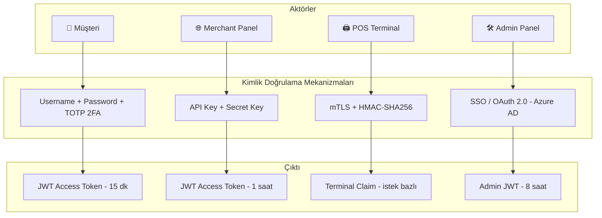
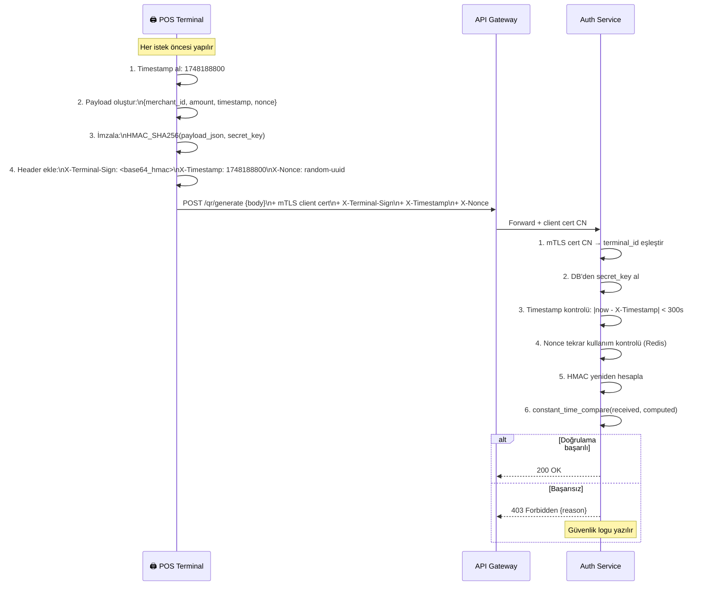
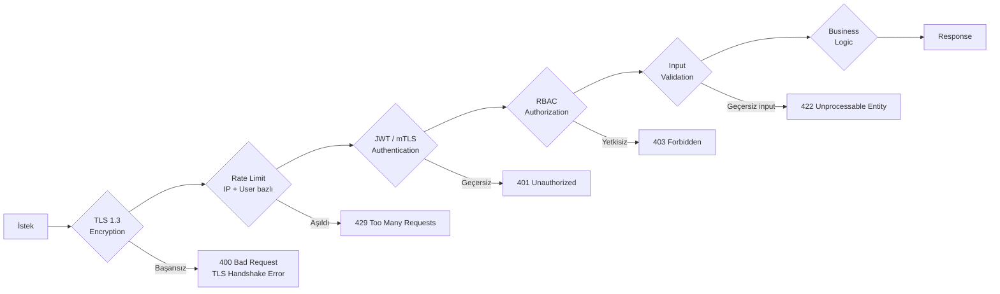
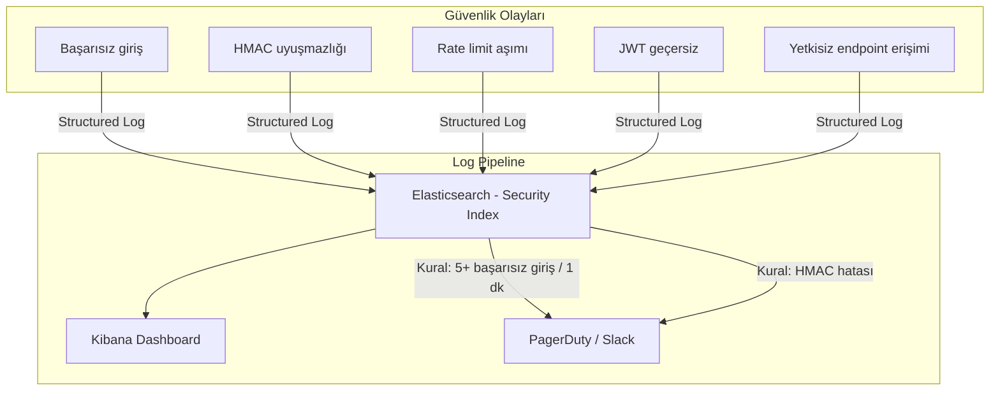

# Security — Cross-Cutting Güvenlik Mimarisi

> **Related Modules:**
> - [`../01-auth-service/`](../01-auth-service/README.md) — JWT, mTLS, HMAC implementasyonu.
> - [`../02-onboarding-service/`](../02-onboarding-service/README.md) — KVKK, PII saklama kuralları.
> - [`../07-infrastructure/`](../07-infrastructure/README.md) — API Gateway rate limiting, ağ izolasyonu.
> - [`../11-adr/`](../11-adr/README.md) — ADR-004: Güvenlik katmanı kararları.

---

## 1. Purpose & Scope (Amaç ve Kapsam)

Bu belge, sistemin tamamına uygulanan güvenlik katmanlarını ve politikalarını tanımlar. Tek bir servise özgü güvenlik detayları ilgili servis dokümanında bulunur; bu belge **yatay (cross-cutting) güvenlik prensiplerine** odaklanır.

**Güvenlik katmanları:**

| Katman | Mekanizma | Kapsam |
|---|---|---|
| **Transport** | TLS 1.3 | Tüm servisler arası ve dış iletişim |
| **Authentication** | JWT (RS256) + mTLS + API Key | Kullanıcı, Terminal, Merchant |
| **Authorization** | RBAC (Role-Based Access Control) | Endpoint erişim kontrolü |
| **Message Integrity** | HMAC-SHA256 | Terminal → API Gateway |
| **Data Protection** | BCrypt, AES-256, SHA-256 | Şifre, belge, kimlik verisi |
| **Rate Limiting** | Token bucket | Brute-force, DDoS engelleme |
| **Audit Logging** | Elasticsearch + SIEM | Her güvenlik olayı izleniyor |

---

## 2. Authentication Mimarisi

### 2.1 Aktör Bazlı Kimlik Doğrulama



### 2.2 JWT Claim Yapısı (Role Bazlı)

```json
// Müşteri JWT
{
  "sub": "user-uuid",
  "role": "customer",
  "wallet_id": "wallet-uuid",
  "iss": "auth.xox-pay.com",
  "exp": 1748189700
}

// Merchant JWT
{
  "sub": "merchant-uuid",
  "role": "merchant",
  "merchant_id": "MERCH-XOX-999",
  "terminal_ids": ["TERM-001", "TERM-002"],
  "iss": "auth.xox-pay.com",
  "exp": 1748192400
}

// Admin JWT
{
  "sub": "admin-uuid",
  "role": "admin",
  "permissions": ["read:all", "write:reconciliation"],
  "iss": "auth.xox-pay.com",
  "exp": 1748217600
}
```

---

## 3. Authorization — RBAC Matrisi

Her endpoint, hangi role'ün erişebileceğini API Gateway seviyesinde kontrol eder.

| Endpoint | customer | merchant | terminal | admin |
|---|:---:|:---:|:---:|:---:|
| `POST /auth/token` | ✅ | ✅ | ✅ | ✅ |
| `GET /wallet/balance` | ✅ (kendi) | ❌ | ❌ | ✅ |
| `POST /wallet/topup` | ✅ (kendi) | ❌ | ❌ | ✅ |
| `POST /wallet/provision` | ✅ | ❌ | ❌ | ❌ |
| `POST /qr/generate` | ❌ | ❌ | ✅ | ✅ |
| `GET /qr/validate/:token` | ✅ | ❌ | ❌ | ✅ |
| `POST /transaction/initiate` | ✅ | ❌ | ❌ | ❌ |
| `GET /report/customer/statement` | ✅ (kendi) | ❌ | ❌ | ✅ |
| `GET /report/merchant/daily-summary` | ❌ | ✅ (kendi) | ❌ | ✅ |
| `GET /report/reconciliation` | ❌ | ❌ | ❌ | ✅ |

> **Row-level security:** `customer` rolü yalnızca kendi `wallet_id`'siyle eşleşen verilere erişebilir. JWT'deki `wallet_id` claim'i ile istek parametresi karşılaştırılır; uyuşmazlık → `403 Forbidden`.

---

## 4. HMAC-SHA256 Terminal İmzası

### 4.1 İmzalama Akışı



### 4.2 Replay Attack Koruması

```
Nonce: Her istekte benzersiz UUID
Timestamp: Unix timestamp (±5 dakika tolerans)
Redis kontrolü: SET nonce:{uuid} 1 EX 300 NX
               → Aynı nonce ikinci kez kullanılamaz
```

---

## 5. Veri Koruma Politikası

### 5.1 Hassas Veri Sınıflandırması

| Veri | Sınıf | Saklama Yöntemi |
|---|---|---|
| Şifre | **Kritik** | BCrypt hash (cost=12) — düz metin asla |
| TCKN | **Kritik** | SHA-256(TCKN + salt) hash — ham veri asla |
| KYC Belgesi | **Gizli** | AES-256-GCM şifreli Blob Storage |
| IBAN | **Gizli** | Şifreli + maskelenmiş görüntü |
| Kart numarası | **N/A** | Sistem kart numarası işlemez (PCI-DSS kapsam dışı) |
| JWT | **Hassas** | Kısa ömürlü + blacklist mekanizması |
| Telefon numarası | **Kişisel** | Log'larda maskelenir |

### 5.2 Veri Maskeleme Kuralları

```csharp
// Log maskeleme — Serilog Enricher örneği
public static class MaskingPolicy
{
    public static string MaskPhone(string phone) =>
        phone.Length > 6
            ? phone[..4] + new string('*', phone.Length - 6) + phone[^2..]
            : "****";
    // +905321234567 → +905*******67

    public static string MaskIban(string iban) =>
        iban[..4] + new string('*', iban.Length - 8) + iban[^4..];
    // TR330006...4321 → TR33****4321

    public static string MaskWalletId(string id) =>
        "****-****-****-" + id[^4..];
}
```

---

## 6. Güvenlik Akışı — Katmanlı Savunma



---

## 7. OWASP Top 10 — Alınan Önlemler

| OWASP Riski | Sistemdeki Önlem |
|---|---|
| **A01: Broken Access Control** | RBAC + row-level JWT claim kontrolü |
| **A02: Cryptographic Failures** | TLS 1.3, RS256, BCrypt, AES-256 |
| **A03: Injection** | Parametreli sorgular (EF Core) — SQL injection imkânsız |
| **A04: Insecure Design** | Threat modeling, Bounded Context izolasyonu |
| **A05: Security Misconfiguration** | IaC ile yönetilen config, secret'lar vault'ta |
| **A06: Vulnerable Components** | Dependabot, NuGet package audit |
| **A07: Auth Failures** | TOTP 2FA, hesap kilitleme, rate limiting |
| **A08: Software Integrity** | Docker image imzalama, SBOM |
| **A09: Logging Failures** | Tüm auth olayları Elasticsearch'e, SIEM alert |
| **A10: SSRF** | Outbound whitelist; servisler dış URL'ye istek yapamaz |

---

## 8. Güvenlik Denetimi ve İzleme



