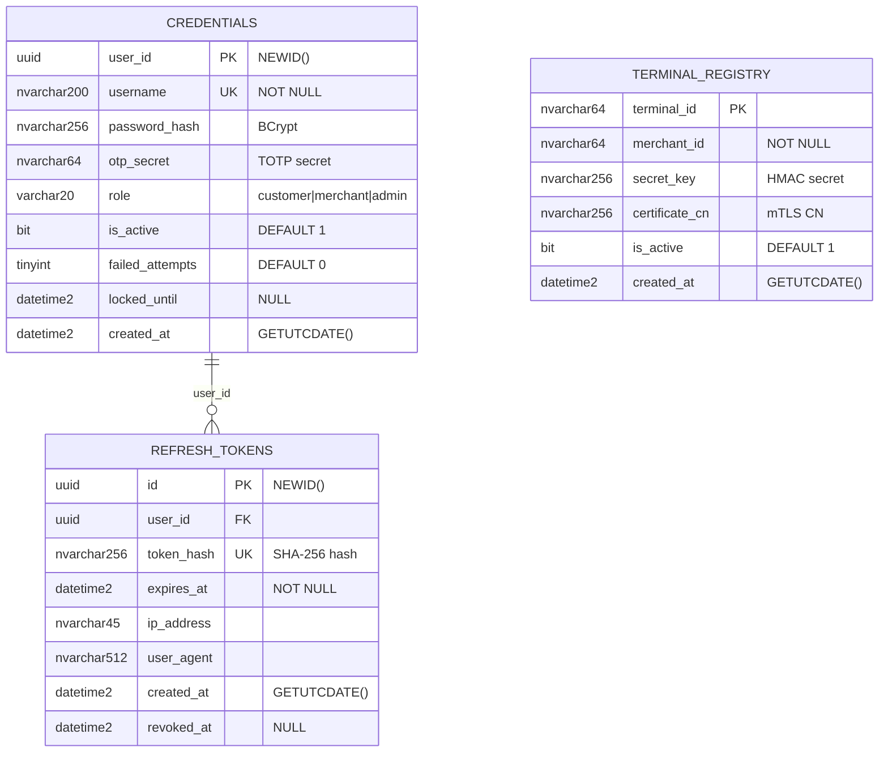
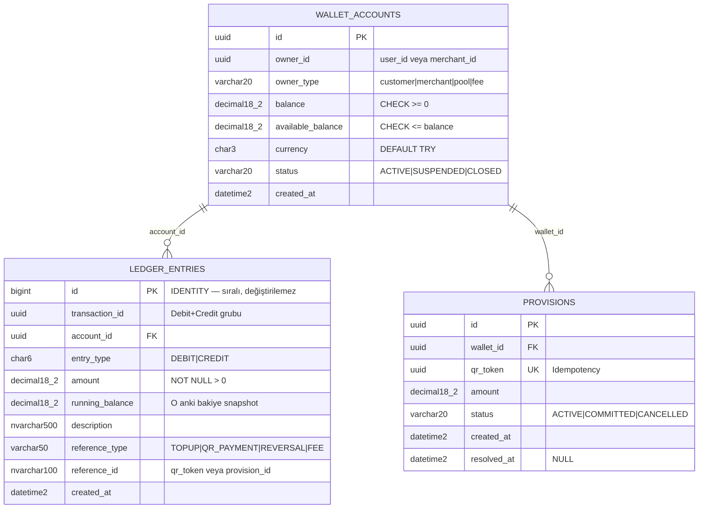
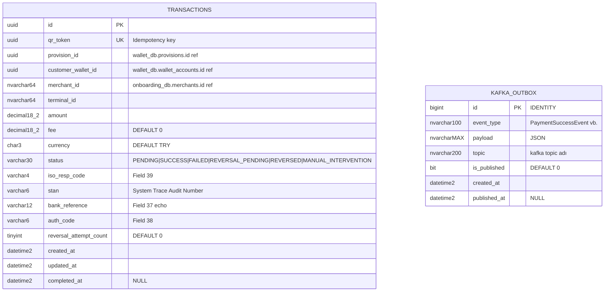
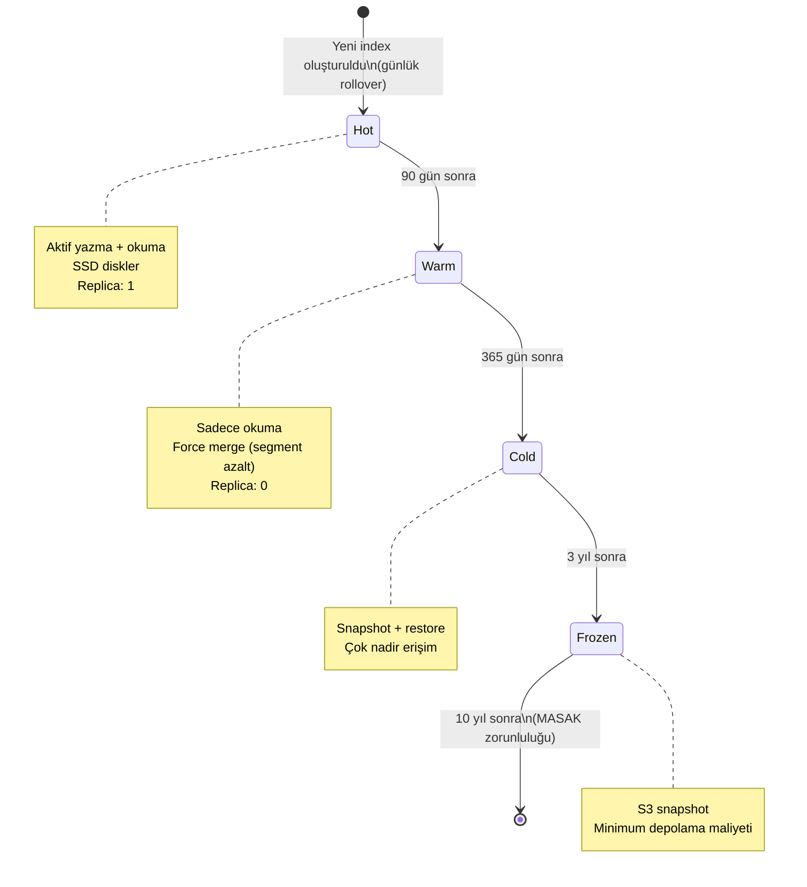
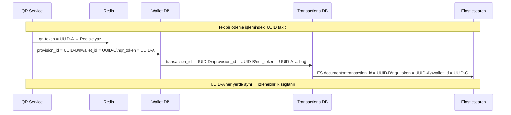

# Data Models — Veri Modelleri, ER Diyagramları ve Servisler Arası İlişkiler

> **Related Modules:**
> - [`../03-wallet-service/`](../03-wallet-service/README.md) — wallet_accounts, ledger_entries, provisions şemaları.
> - [`../05-transaction-service/`](../05-transaction-service/README.md) — transactions, kafka_outbox şemaları.
> - [`../06-reporting-service/`](../06-reporting-service/README.md) — Elasticsearch index mapping.
> - [`../07-infrastructure/`](../07-infrastructure/README.md) — Index stratejisi ve MSSQL konfigürasyonu.

---

## 1. Purpose & Scope (Amaç ve Kapsam)

Bu belge, sistemdeki tüm kalıcı veri modellerini tek bir yerde toplar. Her servis kendi veritabanını yönetir; bu belge hem bireysel şemaları hem de servisler arası veri ilişkilerini (event bazlı bağlantılar) görselleştirir.

**Temel tasarım kararları:**

| Karar | Gerekçe |
|---|---|
| Her servis ayrı DB | Loose coupling; bir servisin şema değişikliği diğerini etkilemez |
| UUID (GUID) primary key | Dağıtık ortamda çakışmasız ID üretimi |
| `DATETIME2` timestamp | Milisaniye hassasiyeti; `DATETIME`'dan daha doğru |
| `DECIMAL(18,2)` para | Floating point hatası yok; 18 hane yeterli |
| Soft delete | Finansal veriler hiçbir zaman fiziksel olarak silinmez |

---

## 2. Servisler Arası Veri İlişkisi (Büyük Resim)

Servisler doğrudan JOIN yapmaz. İlişkiler event tabanlıdır ve `user_id`, `wallet_id`, `qr_token` gibi paylaşılan UUID'ler üzerinden kurulur.

```mermaid
erDiagram
    %% Auth DB
    CREDENTIALS {
        uuid user_id PK
        string username UK
        string password_hash
        string otp_secret
        string role
        bit is_active
    }

    REFRESH_TOKENS {
        uuid id PK
        uuid user_id FK
        string token_hash
        datetime2 expires_at
    }

    TERMINAL_REGISTRY {
        string terminal_id PK
        string merchant_id
        string secret_key
        bit is_active
    }

    %% Onboarding DB
    CUSTOMERS {
        uuid id PK
        string full_name
        string phone UK
        string tckn_hash
        string status
        smallint kyc_risk_score
        datetime2 aml_checked_at
    }

    MERCHANTS {
        uuid id PK
        string company_name
        string tax_number UK
        string iban
        varchar4 mcc
        string status
    }

    STORES {
        uuid id PK
        uuid merchant_id FK
        string store_name
        string address
        string status
    }

    %% Wallet DB
    WALLET_ACCOUNTS {
        uuid id PK
        uuid owner_id
        string owner_type
        decimal balance
        decimal available_balance
        char currency
    }

    LEDGER_ENTRIES {
        bigint id PK
        uuid transaction_id
        uuid account_id FK
        string entry_type
        decimal amount
        decimal running_balance
    }

    PROVISIONS {
        uuid id PK
        uuid wallet_id FK
        uuid qr_token
        decimal amount
        string status
    }

    %% Transactions DB
    TRANSACTIONS {
        uuid id PK
        uuid qr_token UK
        uuid provision_id
        uuid customer_wallet_id
        string merchant_id
        decimal amount
        string status
        string iso_resp_code
    }

    KAFKA_OUTBOX {
        bigint id PK
        string event_type
        string payload
        string topic
        bit is_published
    }

    %% İlişkiler (event bazlı - kesikli)
    CREDENTIALS ||--o{ REFRESH_TOKENS : "user_id"
    WALLET_ACCOUNTS ||--o{ LEDGER_ENTRIES : "account_id"
    WALLET_ACCOUNTS ||--o{ PROVISIONS : "wallet_id"
    CUSTOMERS ..o{ CREDENTIALS : "user_id (event)"
    CUSTOMERS ..o{ WALLET_ACCOUNTS : "user_id (event)"
    TRANSACTIONS ..o{ PROVISIONS : "provision_id (event)"
    MERCHANTS ||--o{ STORES : "merchant_id"
    STORES ..o{ TERMINAL_REGISTRY : "store_id (event)"
```

> **Noktalı çizgi (..o{):** Doğrudan FK ilişkisi değil, event ile bağlı servisler arası referans. JOIN yapılamaz.

---

## 3. Auth DB — Detaylı Şema



---

## 4. Wallet DB — Detaylı Şema (Double-Entry)



### 4.1 Double-Entry İşlem Örneği (50 TL QR Ödeme)

Her başarılı QR ödemesinde **6 ledger satırı** yazılır:

| # | transaction_id | account | entry_type | amount | Açıklama |
|---|---|---|---|---|---|
| 1 | `tx-abc` | customer_wallet | DEBIT | 50.00 | Müşteri ödemesi |
| 2 | `tx-abc` | pool_account | CREDIT | 50.00 | Havuza giriş |
| 3 | `tx-abc` | pool_account | DEBIT | 48.50 | İşyerine transfer |
| 4 | `tx-abc` | merchant_wallet | CREDIT | 48.50 | İşyeri geliri |
| 5 | `tx-abc` | pool_account | DEBIT | 1.50 | Komisyon transfer |
| 6 | `tx-abc` | fee_account | CREDIT | 1.50 | Platform komisyonu |

> **Kontrol:** Her `transaction_id` için `SUM(DEBIT) == SUM(CREDIT)` — bu her zaman doğru olmalı. Muhasebe dengesi bozulursa kritik bug var demektir.

---

## 5. Transactions DB — Detaylı Şema



---

## 6. Elasticsearch — Index Şemaları

### 6.1 transactions Index

```json
{
  "mappings": {
    "properties": {
      "transaction_id":   { "type": "keyword" },
      "qr_token":         { "type": "keyword" },
      "type":             { "type": "keyword" },
      "status":           { "type": "keyword" },
      "wallet_id":        { "type": "keyword" },
      "merchant_id":      { "type": "keyword" },
      "merchant_name":    {
        "type": "text",
        "fields": { "keyword": { "type": "keyword" } }
      },
      "terminal_id":      { "type": "keyword" },
      "amount":           { "type": "double" },
      "fee":              { "type": "double" },
      "currency":         { "type": "keyword" },
      "iso_resp_code":    { "type": "keyword" },
      "timestamp":        { "type": "date", "format": "strict_date_time" },
      "completed_at":     { "type": "date" }
    }
  },
  "settings": {
    "number_of_shards": 3,
    "number_of_replicas": 1,
    "index.lifecycle.name": "transactions-ilm-policy"
  }
}
```

### 6.2 ILM (Index Lifecycle Management) Policy



---

## 7. Veri Akışı — Servisler Arası UUID Takibi

Bir QR ödemesinin yaşam döngüsü boyunca taşınan UUID'ler:



