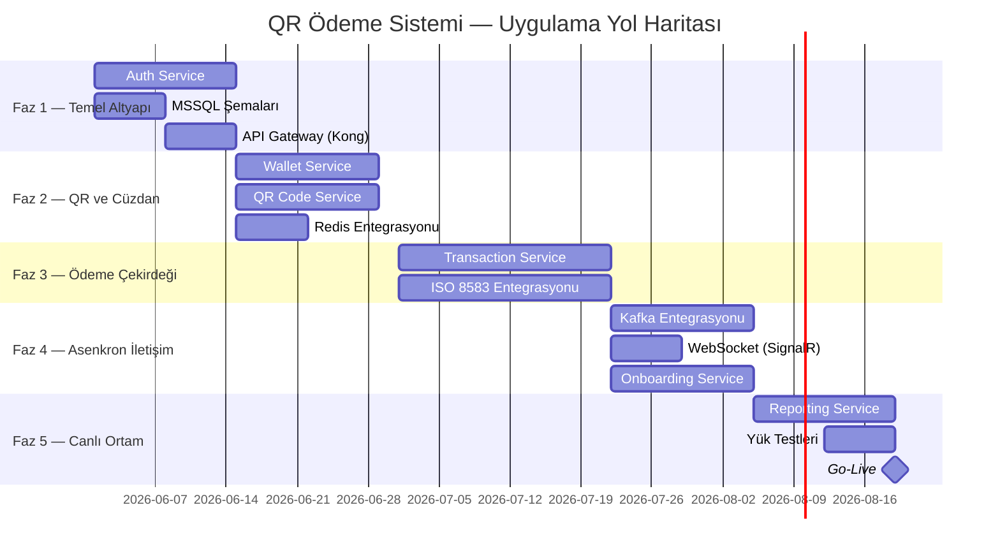
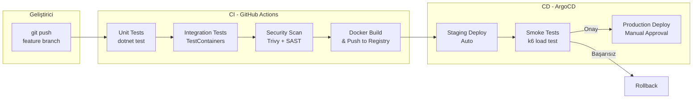

# Deployment — Uygulama Fazları, Docker ve Kubernetes

> **Related Modules:**
> - [`../07-infrastructure/`](../07-infrastructure/README.md) — Altyapı bileşen konfigürasyonları.
> - [`../08-security/`](../08-security/README.md) — Secret yönetimi, ortam konfigürasyonu.
> - [`../11-adr/`](../11-adr/README.md) — ADR-005: Container orchestration kararı.

---

## 1. Purpose & Scope (Amaç ve Kapsam)

Bu belge, sistemin geliştirme ortamından production'a taşınma sürecini, Docker imaj yapısını ve Kubernetes deploy stratejisini kapsar. Aynı zamanda 5 fazlı uygulama yol haritasını detaylandırır.

---

## 2. Deployment Fazları (Yol Haritası)



### Faz Detayları

| Faz | Kapsam | Çıktı |
|---|---|---|
| **Faz 1** | Auth Service, MSSQL şemaları, API Gateway | Kullanıcılar login yapabilir |
| **Faz 2** | Wallet + QR Service, Redis | QR üretilebilir, bakiye yüklenebilir |
| **Faz 3** | Transaction Service, ISO 8583 | Gerçek banka ödeme akışı çalışıyor |
| **Faz 4** | Kafka, WebSocket, Onboarding | Tüm servisler event-driven bağlantıda |
| **Faz 5** | Reporting, Load Test, Go-Live | Sistem production'da canlı |

---

## 3. Docker — Konteyner Yapısı

### 3.1 Örnek Dockerfile (.NET 10 Mikroservis)

```dockerfile
# ---- Build Stage ----
FROM mcr.microsoft.com/dotnet/sdk:10.0 AS build
WORKDIR /src

# Sadece csproj kopyala — bağımlılık değişmezse layer cache kullanılır
COPY ["WalletService/WalletService.csproj", "WalletService/"]
RUN dotnet restore "WalletService/WalletService.csproj"

COPY . .
WORKDIR "/src/WalletService"
RUN dotnet publish -c Release -o /app/publish --no-restore

# ---- Runtime Stage ----
FROM mcr.microsoft.com/dotnet/aspnet:10.0 AS runtime
WORKDIR /app

# Güvenlik: root olmayan kullanıcı
RUN addgroup --system appgroup && adduser --system --ingroup appgroup appuser
USER appuser

COPY --from=build /app/publish .

# Sağlık kontrolü
HEALTHCHECK --interval=30s --timeout=10s --start-period=5s --retries=3 \
    CMD curl -f http://localhost:8080/health || exit 1

EXPOSE 8080
ENTRYPOINT ["dotnet", "WalletService.dll"]
```

### 3.2 Docker Compose (Geliştirme Ortamı)

```yaml
# docker-compose.yml
version: "3.9"

services:
  # ---- Altyapı ----
  mssql:
    image: mcr.microsoft.com/mssql/server:2022-latest
    environment:
      ACCEPT_EULA: "Y"
      SA_PASSWORD: "${MSSQL_SA_PASSWORD}"
    ports: ["1433:1433"]
    volumes: [mssql_data:/var/opt/mssql]
    healthcheck:
      test: /opt/mssql-tools/bin/sqlcmd -S localhost -U sa -P "${MSSQL_SA_PASSWORD}" -Q "SELECT 1"
      interval: 10s

  redis:
    image: redis:7-alpine
    command: redis-server --requirepass ${REDIS_PASSWORD}
    ports: ["6379:6379"]
    volumes: [redis_data:/data]

  kafka:
    image: confluentinc/cp-kafka:7.6.0
    environment:
      KAFKA_BROKER_ID: 1
      KAFKA_ZOOKEEPER_CONNECT: zookeeper:2181
      KAFKA_ADVERTISED_LISTENERS: PLAINTEXT://kafka:9092
      KAFKA_AUTO_CREATE_TOPICS_ENABLE: "false"
    depends_on: [zookeeper]
    ports: ["9092:9092"]

  zookeeper:
    image: confluentinc/cp-zookeeper:7.6.0
    environment:
      ZOOKEEPER_CLIENT_PORT: 2181

  elasticsearch:
    image: elasticsearch:8.13.0
    environment:
      discovery.type: single-node
      xpack.security.enabled: "false"   # Dev ortamı için
      ES_JAVA_OPTS: "-Xms512m -Xmx512m"
    ports: ["9200:9200"]

  kong:
    image: kong:3.6
    environment:
      KONG_DATABASE: "off"
      KONG_DECLARATIVE_CONFIG: /kong/kong.yml
      KONG_PROXY_LISTEN: 0.0.0.0:8000
      KONG_ADMIN_LISTEN: 0.0.0.0:8001
    volumes: [./kong/kong.yml:/kong/kong.yml]
    ports: ["8000:8000", "8001:8001"]
    depends_on: [auth-service]

  # ---- Mikroservisler ----
  auth-service:
    build: ./AuthService
    environment:
      ConnectionStrings__AuthDb: "Server=mssql;Database=auth_db;User Id=sa;Password=${MSSQL_SA_PASSWORD};Encrypt=false"
      Redis__ConnectionString: "redis:6379,password=${REDIS_PASSWORD}"
      Jwt__PrivateKeyPath: /certs/private.pem
    volumes: [./certs:/certs:ro]
    depends_on: [mssql, redis]
    ports: ["8081:8080"]

  wallet-service:
    build: ./WalletService
    environment:
      ConnectionStrings__WalletDb: "Server=mssql;Database=wallet_db;User Id=sa;Password=${MSSQL_SA_PASSWORD};Encrypt=false"
      Kafka__BootstrapServers: "kafka:9092"
    depends_on: [mssql, kafka]
    ports: ["8082:8080"]

  qr-service:
    build: ./QRCodeService
    environment:
      Redis__ConnectionString: "redis:6379,password=${REDIS_PASSWORD}"
      Kafka__BootstrapServers: "kafka:9092"
    depends_on: [redis, kafka]
    ports: ["8083:8080"]

  transaction-service:
    build: ./TransactionService
    environment:
      ConnectionStrings__TransactionDb: "Server=mssql;Database=transactions_db;..."
      Kafka__BootstrapServers: "kafka:9092"
      Bank__Host: "${BANK_HOST}"
      Bank__Port: "${BANK_PORT}"
    depends_on: [mssql, kafka]
    ports: ["8084:8080"]

  reporting-service:
    build: ./ReportingService
    environment:
      Elasticsearch__Uri: "http://elasticsearch:9200"
      Kafka__BootstrapServers: "kafka:9092"
    depends_on: [elasticsearch, kafka]
    ports: ["8085:8080"]

volumes:
  mssql_data:
  redis_data:
```

---

## 4. Kubernetes — Production Konfigürasyonu

### 4.1 Wallet Service Deployment

```yaml
# k8s/wallet-service/deployment.yaml
apiVersion: apps/v1
kind: Deployment
metadata:
  name: wallet-service
  namespace: xoxpay
  labels:
    app: wallet-service
    version: "1.0.0"
spec:
  replicas: 3
  selector:
    matchLabels:
      app: wallet-service
  template:
    metadata:
      labels:
        app: wallet-service
    spec:
      containers:
        - name: wallet-service
          image: xoxpay/wallet-service:1.0.0
          ports:
            - containerPort: 8080
          env:
            - name: MSSQL_PASSWORD
              valueFrom:
                secretKeyRef:
                  name: mssql-secret
                  key: password
            - name: KAFKA_BOOTSTRAP_SERVERS
              valueFrom:
                configMapKeyRef:
                  name: kafka-config
                  key: bootstrap-servers

          # Kaynak sınırları
          resources:
            requests:
              cpu: "100m"      # 0.1 CPU core
              memory: "256Mi"
            limits:
              cpu: "500m"      # 0.5 CPU core
              memory: "512Mi"

          # Sağlık kontrolleri
          readinessProbe:
            httpGet:
              path: /health/ready
              port: 8080
            initialDelaySeconds: 10
            periodSeconds: 5

          livenessProbe:
            httpGet:
              path: /health/live
              port: 8080
            initialDelaySeconds: 30
            periodSeconds: 10

      # Pod dağılımı (aynı node'a hep aynı servis konmasın)
      topologySpreadConstraints:
        - maxSkew: 1
          topologyKey: kubernetes.io/hostname
          whenUnsatisfiable: DoNotSchedule
          labelSelector:
            matchLabels:
              app: wallet-service
```

### 4.2 Horizontal Pod Autoscaler (HPA)

```yaml
# k8s/wallet-service/hpa.yaml
apiVersion: autoscaling/v2
kind: HorizontalPodAutoscaler
metadata:
  name: wallet-service-hpa
  namespace: xoxpay
spec:
  scaleTargetRef:
    apiVersion: apps/v1
    kind: Deployment
    name: wallet-service
  minReplicas: 3
  maxReplicas: 10
  metrics:
    - type: Resource
      resource:
        name: cpu
        target:
          type: Utilization
          averageUtilization: 70    # CPU %70'i geçince yeni pod ekle
    - type: Resource
      resource:
        name: memory
        target:
          type: Utilization
          averageUtilization: 80
```

### 4.3 Secret Yönetimi

```yaml
# k8s/secrets.yaml — Secret'lar asla düz metin değil
apiVersion: v1
kind: Secret
metadata:
  name: mssql-secret
  namespace: xoxpay
type: Opaque
data:
  # base64 encoded (production'da HashiCorp Vault'tan inject edilir)
  password: <BASE64_ENCODED_PASSWORD>
---
# External Secrets Operator ile Vault entegrasyonu (production)
apiVersion: external-secrets.io/v1beta1
kind: ExternalSecret
metadata:
  name: mssql-vault-secret
spec:
  refreshInterval: 1h
  secretStoreRef:
    name: vault-backend
    kind: ClusterSecretStore
  target:
    name: mssql-secret
  data:
    - secretKey: password
      remoteRef:
        key: xoxpay/mssql
        property: password
```

---

## 5. CI/CD Pipeline



### GitHub Actions Workflow (özet)

```yaml
# .github/workflows/ci.yml
name: CI Pipeline

on:
  push:
    branches: [main, develop]
  pull_request:

jobs:
  test:
    runs-on: ubuntu-latest
    steps:
      - uses: actions/checkout@v4
      - uses: actions/setup-dotnet@v4
        with: { dotnet-version: "10.0.x" }
      - run: dotnet restore
      - run: dotnet test --no-restore --logger trx

  security-scan:
    runs-on: ubuntu-latest
    steps:
      - uses: aquasecurity/trivy-action@master
        with:
          image-ref: xoxpay/wallet-service:${{ github.sha }}
          severity: CRITICAL,HIGH
          exit-code: 1    # Kritik açık varsa pipeline başarısız olur

  build-push:
    needs: [test, security-scan]
    runs-on: ubuntu-latest
    steps:
      - run: docker build -t xoxpay/wallet-service:${{ github.sha }} ./WalletService
      - run: docker push xoxpay/wallet-service:${{ github.sha }}
```

---

## 6. Ortam Konfigürasyonu

| Ortam | Amaç | Özellikler |
|---|---|---|
| **Local (dev)** | Geliştirici makinesi | Docker Compose, mock bank, single replica |
| **Staging** | Test ve QA | Kubernetes, gerçek Kafka, test bank bağlantısı |
| **Production** | Canlı sistem | Multi-replica, HA MSSQL, gerçek banka |

```
.env.development     ← local geliştirme değerleri
.env.staging         ← staging değerleri (CI/CD tarafından inject)
.env.production      ← production (Vault'tan gelir, dosyada olmaz)
```

---

## 7. Research & Open Questions (Yeni Başlayanlar İçin Araştırma Rehberi)

> Bu bölüm, Docker ve deployment konularına yeni başlayan backend geliştiriciler için hazırlanmıştır.

---

- **📚 Docker nedir? "Konteyner" ne anlama gelir?**
  "Bende çalışıyor ama sunucuda çalışmıyor" problemi yaşadın mı? Docker tam bu sorunu çözer.
  - "VM (Virtual Machine)" ile "Container" arasındaki farkı araştır: Container neden daha hafiftir?
  - Docker image, container, Dockerfile kavramlarını öğren. Image bir "şablon", container onun çalışan halidir.
  - **Dene:** `docker run -it --rm mcr.microsoft.com/dotnet/sdk:10.0 bash` komutuyla .NET SDK container'ı başlat ve `dotnet --version` çalıştır.

---

- **📚 Multi-stage Dockerfile neden kullanıyoruz?**
  Yukarıdaki Dockerfile'da `FROM ... AS build` ve `FROM ... AS runtime` var. Neden iki aşamalı?
  - Build stage: SDK (700 MB) ile derle. Runtime stage: Sadece runtime (200 MB) ile çalıştır.
  - Final image'a SDK girmez — güvenlik ve boyut avantajı.
  - **Dene:** Tek aşamalı ve çift aşamalı Dockerfile ile image boyutunu karşılaştır: `docker images`.

---

- **📚 Kubernetes nedir? Docker Compose yeterli değil mi?**
  Production'da binlerce istek geldiğinde 1 container yetmez — otomatik ölçeklendirme gerekir.
  - Kubernetes'in temel kavramlarını öğren: Pod, Deployment, Service, Namespace.
  - HPA (Horizontal Pod Autoscaler) CPU %70'i geçince yeni pod ekledi. Bu "scaling out" — "scaling up"dan farkı nedir?
  - **Anahtar soru:** Bir pod çökerse Kubernetes ne yapar? "Self-healing" nasıl çalışır?

---

- **📚 Readiness vs Liveness Probe — ikisi neden farklı?**
  `readinessProbe` ve `livenessProbe` iki ayrı health check — neden?
  - **Liveness:** "Bu pod hâlâ yaşıyor mu?" — Hayır ise restart et.
  - **Readiness:** "Bu pod trafik alabilir mi?" — Hayır ise traffic gönderme (ama restart etme).
  - **Senaryo:** Servis başladı ama DB bağlantısını henüz kuramadı. Liveness OK, Readiness FAIL olmalı. Neden?
  - **Anahtar soru:** Her ikisi de `/health` endpoint'i kullansa ne olur?

---

- **📚 CI/CD nedir? Neden kod her commit'te otomatik deploy edilmeli?**
  GitHub'a push ettikten sonra testler otomatik çalışıyor, Docker image otomatik build ediliyor. Bu CI/CD.
  - **CI (Continuous Integration):** Kod değişikliği her commit'te otomatik test edilir.
  - **CD (Continuous Delivery/Deployment):** Test geçtikten sonra otomatik staging'e, onay sonrası production'a gider.
  - **Anahtar soru:** "Production'a deployment sadece salı günleri yapılır" politikasının dezavantajı nedir? Sık deploy neden daha güvenlidir?
